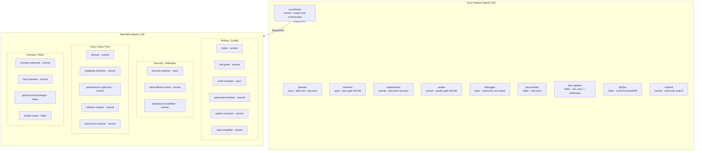
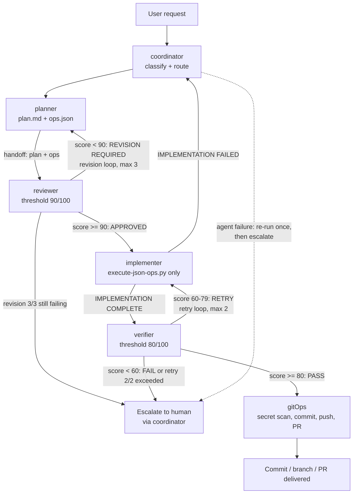

# ClaudeKit Agent System Reference

This document is the complete AI-to-AI handover reference for the ClaudeKit multi-agent system. The system lives in `.claude/agents/` and consists of **28 agent definition files**, two meta docs (`HANDOFF_PROTOCOL.md`, `QUICK_START.md`), and **8 shared protocol files** in `.claude/agents/_shared/`. Agents are markdown files with YAML frontmatter (`name`, `description`, `model`, `color`, `tools`) followed by the agent's system prompt. The Coordinator classifies incoming tasks and routes them through named pipelines; work moves between agents via a standardized handoff block; plans are gated by the Reviewer (90/100) and implementations by the Verifier (80/100).

Related sibling docs: [./COMMANDS.md](./COMMANDS.md), [./PROMPTS.md](./PROMPTS.md), [./HOOKS.md](./HOOKS.md), [./SKILLS.md](./SKILLS.md), [./ARCHITECTURE.md](./ARCHITECTURE.md).

---

## Table of Contents

- [Architecture Diagrams](#architecture-diagrams)
- [Agent Interaction Model](#agent-interaction-model)
- **Core Pipeline Agents**
  - [coordinator](#coordinator) | [planner](#planner) | [reviewer](#reviewer) | [implementer](#implementer) | [verifier](#verifier) | [debugger](#debugger) | [documenter](#documenter) | [doc-updater](#doc-updater) | [gitOps](#gitops) | [explore](#explore)
- **Specialist Agents**
  - [tester](#tester) | [security-scanner](#security-scanner) | [devops](#devops) | [database-architect](#database-architect) | [tdd-guide](#tdd-guide) | [refactor-cleaner](#refactor-cleaner) | [silent-failure-hunter](#silent-failure-hunter) | [harness-optimizer](#harness-optimizer) | [performance-optimizer](#performance-optimizer) | [code-simplifier](#code-simplifier) | [typescript-reviewer](#typescript-reviewer) | [python-reviewer](#python-reviewer) | [code-reviewer](#code-reviewer) | [build-error-resolver](#build-error-resolver) | [loop-operator](#loop-operator) | [opensource-sanitizer](#opensource-sanitizer) | [opensource-packager](#opensource-packager) | [model-router](#model-router)
- **Meta Docs and Shared Protocols**
  - [HANDOFF_PROTOCOL.md](#handoff_protocolmd) | [QUICK_START.md](#quick_startmd) | [AGENT_TEMPLATE.md](#_sharedagent_templatemd) | [CONTEXT_CLEANUP_PROTOCOL.md](#_sharedcontext_cleanup_protocolmd) | [INVOCATION.md](#_sharedinvocationmd) | [OUTPUT_TEMPLATE.md](#_sharedoutput_templatemd) | [TASK_TOOL_SPECIFICATION.md](#_sharedtask_tool_specificationmd) | [VALIDATION_CHECKLIST.md](#_sharedvalidation_checklistmd) | [VERIFICATION_PROTOCOL.md](#_sharedverification_protocolmd) | [WORKFLOW_FILE_TEMPLATES.md](#_sharedworkflow_file_templatesmd)
- [Known Issues](#known-issues)

---

## Architecture Diagrams

### Agent architecture by tier (per QUICK_START.md)



### Feature pipeline with revision and retry loops



---

## Agent Interaction Model

### Handoff block format (from HANDOFF_PROTOCOL.md)

Every agent-to-agent transition MUST use this exact structure — no free-form handoffs:

```
HANDOFF TO: <target-agent>
---
Task: <concise task description>
Classification: <Feature|Bug|Quality|Git|Docs|Explore|Refactor>
Pipeline Position: Step <N> of <M>
Prior Agent Output: <summary of what was produced>
Files Modified: <list of files touched so far>
Constraints:
  - <constraint 1>
  - <constraint 2>
Expected Output: <what the target agent should produce>
Return To: <agent to return to, usually coordinator>
```

Handoff rules: include all required fields, reference files by path (never embed content), state the expected output, specify return routing, include constraints. HANDOFF_PROTOCOL.md also defines agent-specific variants: Planner→Reviewer, Reviewer→Implementer (Approved), Reviewer→Planner (Revision), Implementer→Verifier, Verifier→GitOps (Pass), Verifier→Implementer (Retry), Any→Coordinator (Escalation), Debugger→Planner, TDDGuide→Implementer (Tests Written), SilentFailureHunter+SecurityScanner→Planner (Audit Complete), and RefactorCleaner→Verifier (Batch Removed).

### Named pipelines

| Pipeline | Flow | Source |
|---|---|---|
| **Feature** | Coordinator → Planner → Reviewer → Implementer → Verifier → GitOps (revision loop Planner↔Reviewer, max 3) | coordinator.md, HANDOFF_PROTOCOL.md |
| **Bug** | Coordinator → Debugger → Planner → Reviewer → Implementer → Verifier → GitOps | coordinator.md |
| **Refactor** | Same as Feature (Planner → Reviewer → Implementer → Verifier → GitOps) | coordinator.md |
| **Quality** | Coordinator → Verifier | coordinator.md |
| **Git** | Coordinator → GitOps | coordinator.md |
| **Docs** | Coordinator → DocUpdater (coordinator.md); HANDOFF_PROTOCOL.md splits: Documenter for new docs, DocUpdater for updating existing docs | coordinator.md, HANDOFF_PROTOCOL.md |
| **Explore** | Coordinator → Explore | coordinator.md |
| **TDD** | Coordinator → TDDGuide → Verifier → GitOps | coordinator.md |
| **Dead Code** | Coordinator → RefactorCleaner → Verifier → GitOps | coordinator.md |
| **Performance** | coordinator.md: Coordinator → Explore → PerformanceOptimizer → Verifier → GitOps (parallel: profile + analyze); HANDOFF_PROTOCOL.md: Coordinator → [Explore + PerformanceOptimizer] (parallel) → Planner → Implementer → Verifier | both (they disagree — see Known Issues) |
| **Security Audit** | Coordinator → [SilentFailureHunter + SecurityScanner] (parallel, read-only) → Planner → Implementer → Verifier | coordinator.md, HANDOFF_PROTOCOL.md |
| **Code Quality Audit** | Coordinator → [TypeScriptReviewer \| PythonReviewer] → Implementer (if fixes needed) → Verifier | coordinator.md |
| **EPIC / Blueprint** | Coordinator → Blueprint skill → plan review → per-step execution pipelines | coordinator.md |
| **Open Source** (specialist routing) | OpenSource Pipeline: Sanitizer (Stage 1) → Forker (Stage 2, referenced but no agent file exists) → Packager (Stage 3) | coordinator.md, opensource-*.md |

### Scoring thresholds

| Gate | Threshold | Formula | Outcomes |
|---|---|---|---|
| **Reviewer** (plan gate) | **90/100** | Plan Quality × 0.40 + Architecture × 0.30 + Security × 0.30 | ≥90 APPROVED → Implementer; 70–89 CONDITIONAL → back to Planner; <70 REJECTED → back to Planner. Each return counts as one revision cycle; revision 3 of 3 failing → escalate to Coordinator/human. Mandatory rejections (missing ops.json, invalid JSON, missing rollback, hardcoded secrets, destructive ops without safeguards, missing test strategy, orphaned operations, phantom steps) bypass scoring entirely. |
| **Verifier** (implementation gate) | **80/100** | Static Analysis × 0.30 + Tests × 0.40 + Coverage × 0.30, then anti-pattern penalties (max −30) | ≥80 PASS → GitOps; 60–79 RETRY → back to Implementer (max 2 retries); <60 FAIL → escalate to Coordinator immediately (do not return to Implementer). |

### Escalation rules (coordinator.md)

Escalate to the human user when: (1) revision limit exceeded (3 cycles without approval), (2) an agent reports an unrecoverable error, (3) classification is ambiguous, (4) any agent flags a security concern, (5) destructive operation (data deletion, force-push, production config changes), (6) conflicting requirements. Escalation format includes Reason, Current State, Context, Options, Recommendation.

Coordinator error recovery: log the error in workflow state, re-run the failed agent once with the same inputs, escalate to human if it fails again; never silently skip a pipeline agent, never proceed past a failed agent.

### Failed handoff recovery (HANDOFF_PROTOCOL.md)

If a handoff fails (target agent unavailable, invalid format): (1) log the failure with full context, (2) retry once with the same handoff, (3) if retry fails, escalate to Coordinator, (4) Coordinator decides: retry with different approach, skip the agent (if non-critical), or escalate to human.

### Parallel execution rules (coordinator.md)

Safe combinations: Explore + Debugger; Silent Failure Hunter + Security Scanner; TypeScript Reviewer + Python Reviewer; DocUpdater + GitOps; multiple Verifier instances on independent modules; Explore + Deep Research skill. Hard rules: NEVER run Implementer in parallel with anything; NEVER run GitOps in parallel with Implementer; Reviewer MUST complete before Implementer; Verifier MUST complete before GitOps; TDD Guide MUST produce tests before Implementer writes code.

---

# Core Pipeline Agents

## coordinator

**Purpose.** Orchestration hub for all multi-agent workflows: classifies incoming tasks, selects the pipeline, spawns agents, manages handoffs and revision loops, tracks workflow state, and escalates to humans.

**Responsibilities.** Task classification (Feature/Bug/Quality/Git/Docs/Explore/Refactor/EPIC plus 14 specialist categories), workflow routing, state tracking, revision management, escalation.

**Inputs.** The raw user request. **Outputs.** Pipeline dispatches (handoff blocks), a `WORKFLOW STATUS` progress report to the user, and optionally file-based workflow state.

**Frontmatter (verbatim).**
- `name: coordinator`
- `description: Orchestration agent that analyzes tasks, routes to appropriate agents, manages handoffs, and tracks workflow state. Use when tasks require multiple agents or complex workflows.`
- `model: sonnet` | `color: gray`
- `tools: ["Read", "Grep", "Glob", "Bash", "Agent"]`

**Internal workflow.** (1) Receive and classify → (2) spawn first agent with structured handoff (Spawn Protocol) → (3) process agent output (success → advance; failure → escalation rules; revision → revision loop) → (4) revision loop: increment `revision_count`, escalate if >3, else route back to producing agent → (5) completion: compile summary, present to user, clean up state.

**Dependencies.** Loads 12 skills: `using-superpowers`, `golden-rule`, `multi-agent-coordination`, `dispatching-parallel-agents`, `subagent-driven-development`, `context-first-workflow`, `verification-before-completion`, `autonomous-loop`, `context-budget`, `session-continuity`, `search-first`, `verification-loop`. References Blueprint, Council, Codebase Onboarding, and Deep Research skills in routing. Dispatches all other agents; the Handoff Table describes what each agent expects/produces.

**Memory/context.** In-memory `WORKFLOW STATE` block (task_id, classification, pipeline, current_step, status, revision_count, max_revisions: 3). Persists to `.claude/state/workflow-<task_id>.json` when the pipeline has >3 agents, a revision loop is triggered, or the user requests persistence.

**Failure recovery.** Re-run a failed agent once with same inputs, then escalate. Six explicit escalation triggers (see Interaction Model above). Never skips agents, never proceeds past failures, never exceeds 3 revision cycles.

**Example invocation.** The coordinator is typically the entry point; it dispatches downstream agents per `_shared/TASK_TOOL_SPECIFICATION.md`:

```
TaskCreate:
  prompt: |
    You are the planner agent.
    Read your agent definition: .claude/agents/planner.md

    HANDOFF FROM: coordinator
    ---
    Task: Add user authentication with JWT tokens
    Classification: Feature
    Pipeline Position: Step 1 of 5
    Prior Agent Output: Initial task, no prior output
    Files Modified: None yet
    Expected Output: plan.md + ops.json in .claude/plans/
    Return To: coordinator
  agent: planner
```

**Improvement notes.** Its classification table has no rows for tester, devops, database-architect, or documenter, though all four appear in its Handoff Table. Frontmatter grants the `Agent` tool while `_shared/INVOCATION.md` declares `claude -p --agent` the single spawning source of truth. Its Performance and Docs pipelines disagree with HANDOFF_PROTOCOL.md (see Known Issues).

---

## planner

**Purpose.** Produces implementation plans: a human-readable `plan.md` plus a machine-executable `ops.json` for every task. "Every plan MUST include an ops.json file" is its Iron Law.

**Responsibilities.** Codebase discovery, plan authoring, ops.json generation against the canonical schema, self-validation, revision handling from Reviewer feedback.

**Inputs.** Task description and codebase context (optionally an Explore or Debugger report). **Outputs.** `.claude/plans/plan-<name>.md` and `.claude/plans/ops-<name>.json`, a tiered plan brief (Simple/Medium/Complex), and a `HANDOFF TO: reviewer` block.

**Frontmatter (verbatim).**
- `name: planner`
- `description: Creates implementation plans with JSON operations configs. Explores codebase, generates plan.md and ops.json. Use when a task needs an implementation plan before coding begins.`
- `model: sonnet` | `color: cyan`
- `tools: ["Read", "Grep", "Glob", "Bash", "Agent"]`

**Internal workflow.** Phase 1 Discovery (structure, tech stack, relevant files, tests, conventions) → Phase 2 Create Plan (Overview, Scope, Prerequisites, Steps with File/Action/Details, Testing Strategy, Rollback Plan, Risk Assessment) → Phase 3 Generate ops.json (modern schema: top-level `plan` key; operation types exactly `file_create`/`file_delete`/`code_edit`; `path` key; `edits` array with `find` + one of `replace`/`add_after`/`add_before`/`delete: true`; `additionalProperties: false`; max 3 `file_delete` per config per GUARD 26; validate with `python3 .claude/operations/scripts/validate-config-json.py`) → Phase 4 Save both files and emit handoff.

**Dependencies.** Skills: `using-superpowers`, `golden-rule`, `context-first-workflow`, `brainstorming`, `writing-plans`, `generate-operations-config` (declared "single source of truth for the ops.json schema"). Script: `validate-config-json.py`. Downstream: reviewer.

**Memory/context.** Writes to `.claude/plans/`. Reads the codebase freely. On revision, overwrites the original plan and ops.json and re-triggers the Reviewer without asking permission.

**Failure recovery.** Forbidden from asking mid-plan questions — batches all clarifications up front. Revision feedback loop: read all Reviewer feedback, update both files, re-save, re-trigger Reviewer. Includes a self-review quality checklist before handoff.

**Example invocation.**
```bash
echo "Create a plan for adding a caching layer. Write plan.md and ops.json to .claude/plans/" | \
  claude -p --agent planner --model opus --allowedTools "Read,Grep,Glob,Write,Bash(python3 .claude/operations/scripts/validate-config-json.py *)"
```
(Per `_shared/INVOCATION.md`, planner's scoped tool list is `Read,Grep,Glob,Write` — never Bash.)

**Improvement notes.** Frontmatter tools include `Bash` and `Agent`, but INVOCATION.md's scoped list for planner is `Read,Grep,Glob,Write` (no Bash, no Agent, and Write is absent from the frontmatter list even though the agent must write plan files). The purpose of the `Agent` tool in its frontmatter is never used in the body.

---

## reviewer

**Purpose.** Plan validation gate. Scores `plan.md` + `ops.json` across three weighted dimensions against a **90/100** threshold before anything reaches the Implementer. This is explicitly the plan reviewer, distinct from `code-reviewer.md`.

**Responsibilities.** Pre-validation checks, mandatory rejection rules, weighted scoring, structured findings, revision routing, escalation after 3 revisions.

**Inputs.** `plan.md` and `ops.json` paths (Planner handoff). **Outputs.** `REVIEW REPORT` with score bars, decision (APPROVED / CONDITIONAL / REJECTED), findings by severity, and one of three handoffs (implementer / planner / coordinator).

**Frontmatter (verbatim).**
- `name: reviewer`
- `description: Multi-specialist plan validation with 90/100 approval threshold. Scores Plan Quality (40%), Architecture (30%), Security (30%). Use when a plan.md and ops.json need validation before implementation.`
- `model: opus` | `color: blue`
- `tools: ["Read", "Grep", "Glob"]`

**Internal workflow.** Pre-validation checklist (both files exist, valid JSON, operations match steps, required sections) → mandatory rejection rules (8 automatic rejections that bypass scoring, including missing ops.json and hardcoded secrets) → Step 1 structural validation → Step 2 Plan Quality review (criteria table, 40%) → Step 3 Architecture review (30%) → Step 4 Security review (30%) → decision logic (≥90 approve, 70–89 conditional, <70 reject; revision 3 → escalate).

**Dual Review Mode.** With `--dual` (for security-sensitive plans, DB migrations, public API or auth changes) it loads the `santa-method` skill and spawns two independent sub-reviewers — Reviewer A (Skeptic/Opus, threshold 95) and Reviewer B (Pragmatist/Sonnet, threshold 90) — with anti-anchoring isolation; approval requires both.

**Dependencies.** Skills: `using-superpowers`, `golden-rule`, `validate-operations-config`, `clean-architecture`, `security-checklist`, plus `santa-method` in dual mode. Upstream: planner. Downstream: implementer or planner (revision) or coordinator (escalation).

**Memory/context.** Reads `.claude/plans/`. Read-only (no Write/Edit/Bash in tools). Tracks revision number in its handoffs (`Revision Number: <N> of 3`).

**Failure recovery.** Mandatory rejection path for structural failures; revision handoffs carry Critical/Warning findings; escalation handoff to coordinator at revision 3/3 with remaining issues and recommendation. Never approves below 90, never gives a perfect 100.

**Example invocation.**
```bash
echo "Review the plan at .claude/plans/plan-add-caching.md with ops at .claude/plans/ops-add-caching.json" | \
  claude -p --agent reviewer --model opus --allowedTools "Read,Grep,Glob"
```

**Improvement notes.** Dual mode says to "spawn two independent sub-reviewers in parallel", but its tool list (`Read,Grep,Glob`) contains no Agent/Task/Bash tool with which to spawn anything.

---

## implementer

**Purpose.** Execution engine that turns approved plans into code — exclusively via `python3 .claude/operations/scripts/execute-json-ops.py <ops.json>`. Its Iron Law: direct Edit/Write use is permanently forbidden; no ops.json means STOP and request one from the Planner.

**Responsibilities.** Pre-flight verification of approval and ops.json presence, dry-run, script execution, build/lint/test verification, failure handling, handoff to Verifier.

**Inputs.** Approved `plan.md` + `ops.json` (Reviewer handoff with `Status: APPROVED`). **Outputs.** Modified/created source files (via script), `IMPLEMENTATION COMPLETE`/`FAILED` report, handoff to verifier (success) or coordinator (failure).

**Frontmatter (verbatim).**
- `name: implementer`
- `description: Executes approved plans exclusively via execute-json-ops.py. No ops.json = STOP and request one. Never falls back to manual edits. Use when a plan has been approved by the Reviewer and code changes need to be applied.`
- `model: sonnet` | `color: green`
- `tools: ["Read", "Bash", "Grep", "Glob"]`

**Internal workflow.** Step 0 pre-flight (plan approved, ops.json present, targets exist, build tools available, backups) → Step 1 dry-run (`--dry-run`, stop if unexpected targets) → Step 2 execute → Step 3 verify build/lint/tests using validation commands → Step 4 handle failures (minor fix → new ops.json patch file and re-run script; significant → report to Coordinator; never rewrite large sections manually).

**Dependencies.** Skills: `using-superpowers`, `golden-rule`, `execute-operations-config`, `clean-architecture`, `verification-before-completion`. Script: `.claude/operations/scripts/execute-json-ops.py`. Upstream: reviewer. Downstream: verifier (success), coordinator (failure). Never commits — that is GitOps's job.

**Memory/context.** Reads `.claude/plans/`; relies on git or script-created backups for rollback. Edge cases documented: empty operations array (verify with Coordinator), missing referenced files, missing build tool, pre-existing test failures (report but not its problem), ambiguous plan step (never guess — ask Coordinator).

**Failure recovery.** Script rollback on operation failure; correction patch ops.json for minor issues; escalate to Coordinator with error details, rollback status, and recommendation for anything significant. Never continues after a critical failure, never modifies test expectations, never suppresses linter errors.

**Example invocation.**
```
TaskCreate:
  prompt: |
    You are the implementer agent.
    Read your agent definition: .claude/agents/implementer.md
    HANDOFF FROM: reviewer
    ---
    Status: APPROVED
    Score: 92/100
    Plan File: .claude/plans/plan-add-caching.md
    Ops Config: .claude/plans/ops-add-caching.json
  agent: implementer
```

**Improvement notes.** QUICK_START.md lists its permissions as "Read, Write, Execute" — misleading, since Edit/Write tools are explicitly forbidden and its frontmatter has neither (all writes go through the Bash-invoked script). Its handoff template still offers `Method: <Script|Manual>` despite Manual being banned.

---

## verifier

**Purpose.** Post-implementation quality gate: runs static analysis, tests, and coverage; scores against an **80/100** threshold; decides PASS / RETRY / FAIL.

**Responsibilities.** Environment check, linter/formatter/type-checker runs, full test suite execution, coverage measurement, anti-pattern penalty application, scoring, retry/escalation routing.

**Inputs.** Implementer handoff with modified file list. **Outputs.** `VERIFICATION REPORT` with per-dimension score bars, penalties, decision; handoff to gitOps (pass), implementer (retry, max 2), or coordinator (fail / retry limit).

**Frontmatter (verbatim).**
- `name: verifier`
- `description: Quality validation agent. Runs static analysis, tests, and coverage checks with 80/100 approval threshold. Use after implementation to validate code quality before committing.`
- `model: haiku` | `color: purple`
- `tools: ["Read", "Bash", "Grep", "Glob"]`

**Internal workflow.** Phase 1 environment check + baseline (pre-existing failures, current coverage) → Phase 2 static analysis (score NEW issues only; 30% weight) → Phase 3 test execution (40% weight — highest, "passing tests are the strongest signal of correctness") → Phase 4 coverage analysis (30% weight) → Phase 5 scoring with 10 anti-pattern penalties (suppressed lint warnings −10, skipped tests −5 each max −15, empty catch −10, debug output −5, commented-out code −5, magic numbers −3, duplicate blocks −10, missing error handling −10, broad type assertions −5, assertion without message −3; floor −30) → decision.

**Dependencies.** Skills: `using-superpowers`, `golden-rule`, `test-driven-development`, `verification-before-completion`, `performance-guidelines`. Downstream: gitOps, implementer, coordinator.

**Memory/context.** Read-only regarding code ("NEVER modify code yourself"). Compares against baseline; never counts pre-existing failures as new.

**Failure recovery.** 60–79 → RETRY to Implementer with exact file:line issues ("Fix ONLY the listed issues"), max 2 retries; <60 → FAIL, escalate to Coordinator immediately and recommend re-planning; retry 2/2 exceeded → escalate. Never lowers the threshold, never estimates scores without running tools.

**Example invocation.**
```
TaskCreate:
  prompt: |
    You are the verifier agent.
    Read your agent definition: .claude/agents/verifier.md
    HANDOFF FROM: implementer
    ---
    Status: IMPLEMENTATION COMPLETE
    Files Modified: src/services/cache.ts, src/models/entry.ts
    Build Status: PASS
  agent: verifier
```

**Improvement notes.** Runs on Haiku despite doing scoring judgment calls (test quality, anti-pattern detection); model-router's rubric would likely score this work above Haiku range. Threshold customization is documented in QUICK_START.md ("Adjust thresholds").

---

## debugger

**Purpose.** Read-only bug diagnosis: pattern matching against a known-bug database, log analysis, root cause identification with confidence levels. Produces a diagnosis report for the Planner; cannot edit code.

**Responsibilities.** Context gathering, pattern matching (7 pattern families: threading/concurrency, null reference, resource leaks, configuration, state management, timing/races, JS/TS async/promise errors), log analysis, root cause synthesis, confidence-based handoff.

**Inputs.** Bug report, error logs, stack traces. **Outputs.** `BUG DIAGNOSIS REPORT` (classification, investigation trail, root cause with file:line and confidence %, contributing factors, blast radius, suggested fix approaches with pros/cons, regression prevention).

**Frontmatter (verbatim).**
- `name: debugger`
- `description: Read-only diagnosis agent for bug investigation. Pattern matching, log analysis, root cause identification. Cannot edit code. Use when a bug needs to be investigated and diagnosed before planning a fix.`
- `model: opus` | `color: red`
- `tools: ["Read", "Grep", "Glob", "Bash"]`

**Internal workflow.** Phase 1 gather context (read report, search error message, find stack origin, `git log`/`git diff` recent history, read tests and configs) → Phase 2 pattern matching against the database, ranked by likelihood → Phase 3 log analysis and event timeline → Phase 4 root cause identification (primary cause, contributing factors, trigger, blast radius, fix complexity) → Phase 5 handoff. A bug classification decision flow covers reproducibility and onset timing (git bisect for post-change bugs, leak patterns for gradual onset).

**Dependencies.** Skills: `using-superpowers`, `golden-rule`, `systematic-debugging`; conditionally `test-driven-development`, `performance-guidelines`, `security-checklist`. Downstream: planner (≥70% confidence) or coordinator (<70%, requesting more context with theories and what would confirm/deny each).

**Memory/context.** Read-only; Edit and Write are explicitly FORBIDDEN. Bash limited to read-only commands (git log/diff, builds, tests, log viewers).

**Failure recovery.** Confidence gate at 70%: below it, hands to coordinator with `Status: INSUFFICIENT DATA`, findings so far, needed information, and ranked theories. Never guesses, never reports symptoms as root causes, never runs destructive commands.

**Example invocation.**
```bash
echo "Diagnose: app crashes with NullPointerException when processing orders. Produce a diagnosis report." | \
  claude -p --agent debugger --model opus --allowedTools "Read,Grep,Glob,Bash"
```

**Improvement notes.** None significant; one of the most internally consistent agents. Its report location convention (`.claude/reports/debug-<descriptor>.md`) comes from WORKFLOW_FILE_TEMPLATES.md rather than its own file.

---

## documenter

**Purpose.** Creates and maintains project documentation: READMEs, API docs, architecture guides, setup guides, changelogs, ADRs, runbooks, knowledge base articles. Positioned as the "new documentation" agent (HANDOFF_PROTOCOL.md).

**Responsibilities.** Audience analysis, information gathering from source/tests/history, template-driven generation (10 documentation types with templates), validation (links, code examples, accuracy, no secrets).

**Inputs.** Source files and context. **Outputs.** Documentation files (`*.md`, `docs/`, OpenAPI specs, inline docstrings), `DOCUMENTATION COMPLETE` report with validation results, handoff to coordinator.

**Frontmatter (verbatim).**
- `name: documenter`
- `description: Documentation specialist for technical docs, READMEs, API docs, knowledge base articles. Use when documentation needs to be created or updated.`
- `model: haiku` | `color: teal`
- `tools: ["Read", "Write", "Edit", "Grep", "Glob"]`

**Internal workflow.** Phase 1 analyze (what docs, audience) → Phase 2 gather (source, tests, commit history, configs, examples, edge cases) → Phase 3 generate per template (README, API Reference, Architecture, KB article, ADR) → Phase 4 validate (examples syntactically correct, paths exist, links work, style consistency, no sensitive info, accuracy, spelling, markdown formatting).

**Dependencies.** Skills: `using-superpowers`, `golden-rule`, `documentation-standards`. Downstream: coordinator (complete or needs-input). Cannot commit — GitOps handles that.

**Memory/context.** Explicit permission boundaries: may write only documentation files (`*.md`, `docs/`, doc `.txt`, API specs, inline doc comments, `.claude/` docs); CANNOT edit source logic, configs, tests, build scripts, or run state-modifying commands (it has no Bash tool, consistent with this).

**Failure recovery.** `HANDOFF TO: coordinator` with `Status: NEEDS INPUT`, listing missing information and specific questions for the user.

**Example invocation.**
```
TaskCreate:
  prompt: |
    You are the documenter agent.
    Read your agent definition: .claude/agents/documenter.md
    HANDOFF FROM: coordinator
    ---
    Task: Document the new caching API endpoints in docs/api/
    Expected Output: API reference with runnable examples
    Return To: coordinator
  agent: documenter
```

**Improvement notes.** Its description says "created or updated", overlapping doc-updater's stated scope; the new-vs-existing split exists only in HANDOFF_PROTOCOL.md and QUICK_START.md, not in either agent's own file. The coordinator's Docs pipeline routes only to DocUpdater, leaving documenter without a routing row (see Known Issues).

---

## doc-updater

**Purpose.** Documentation maintenance: keeps docs synchronized with code, generates codemaps (`docs/CODEMAPS/<area>.md` + `INDEX.md`), syncs JSDoc/docstrings, validates that examples compile. Core principle: "Generate from code, don't manually write."

**Responsibilities.** Codemap generation (dependency graphs via madge, exports/routes/models extraction), inline doc updates (JSDoc/TSDoc, Google-style Python docstrings), targeted README updates, example compilation and link checking.

**Inputs.** Recent code changes / API changes / module to map. **Outputs.** Updated `docs/`, `README.md`, `CHANGELOG.md`, codemap files, inline doc comments, `.d.ts` updates.

**Frontmatter (verbatim).**
- `name: doc-updater`
- `description: Documentation maintenance specialist. Updates READMEs, generates codemaps, syncs inline docs (docstrings, JSDoc) with code changes, and validates that all examples compile. Use after feature implementation or API changes.`
- `model: haiku` | `color: cyan`
- `tools: ["Read", "Write", "Edit", "Bash", "Grep", "Glob"]`

**Internal workflow.** Decide whether an update is needed (always for new endpoints/public APIs/signature changes/config options/architecture/setup changes; optional for internal-only changes) → run analysis commands (madge, jsdoc2md, grep for exports/routes/models) → generate codemap in the fixed format (marked `AUTO-GENERATED — do not manually edit`) → update `docs/CODEMAPS/INDEX.md` → update inline docs → update README in place → run the quality checklist (paths exist, examples compile via ts-node/python, links return 200, timestamps updated).

**Dependencies.** No skill-loading section (unlike most agents). Optional external tools: madge, jsdoc2md, ts-node. Routed from the coordinator's Docs pipeline.

**Memory/context.** Writes `docs/`, `README.md`, `CHANGELOG.md`, codemaps, inline docs. Scope boundaries: cannot modify business logic, test files, configuration files, or create migrations.

**Failure recovery.** None specified beyond the quality checklist; no explicit escalation or handoff formats are defined in the file.

**Example invocation.**
```bash
echo "Update docs for the new /payments endpoint: API reference, README endpoint list, JSDoc in the payments service." | \
  claude -p --agent doc-updater --model haiku --allowedTools "Read,Write,Edit,Bash,Grep,Glob"
```

**Improvement notes.** Missing the Mandatory Skill Loading section that nearly every other agent has; missing handoff/escalation formats. Overlaps documenter on READMEs and inline docs (both are Haiku writers of markdown) — the only clean differentiator is codemap generation.

---

## gitOps

**Purpose.** Version control specialist for all Git operations: branching, conventional commits, pushing, PRs, releases — with mandatory pre-commit secret scanning and strong destructive-operation safeguards.

**Responsibilities.** Branch strategy enforcement (feature/bugfix/hotfix/release/docs/refactor naming and rules table), conventional commit formatting (11 types, 72-char subject, `Co-Authored-By: Claude`), secret scanning (8 regex patterns + forbidden file types), push/PR workflows, merge conflict mediation (never auto-resolves).

**Inputs.** Verified source files (Verifier handoff) or direct git task. **Outputs.** Commits, branches, PRs; `GIT OPERATIONS COMPLETE`/`FAILED` report; handoff to coordinator (complete or blocked).

**Frontmatter (verbatim).**
- `name: gitOps`
- `description: Git operations specialist for branching, committing, pushing, PRs. Handles version control safely. Use when code changes need to be committed, branches created, or pull requests opened.`
- `model: haiku` | `color: orange`
- `tools: ["Read", "Bash", "Grep", "Glob"]`

**Internal workflow.** Always `git status` first → security check workflow (list staged files, grep staged diff for secret patterns, check sensitive file extensions, ABORT on any hit) → operation-specific flows (branch creation from pulled main; stage specific files, never blind `git add -A`; commit with heredoc template; verify branch and pull --rebase before push; `gh pr create` with the PR body template).

**Dependencies.** Skills: `using-superpowers`, `golden-rule`, `git-workflow`, `using-git-worktrees`, `finishing-a-development-branch`, `security-checklist`. Uses the `gh` CLI. Upstream: verifier. Downstream: coordinator.

**Memory/context.** Operates only on the git repository state; no plan/state files.

**Failure recovery.** Structured failure report with error, cause, and recovery steps; `HANDOFF TO: coordinator` with `Status: BLOCKED` and what it needs (user approval / conflict resolution). Merge conflicts: identify, show the user, ask which resolution to apply, verify build afterwards. Nine absolute NEVER rules (no force-push to main, no `--no-verify`, no amending pushed commits, no rebasing shared branches, etc.).

**Example invocation.**
```
TaskCreate:
  prompt: |
    You are the gitOps agent.
    Read your agent definition: .claude/agents/gitOps.md
    HANDOFF FROM: verifier
    ---
    Status: VERIFICATION PASSED
    Score: 87/100
    Files Verified: src/services/cache.ts, tests/cache.test.ts
    Expected Output: feature branch, conventional commit, PR
  agent: gitOps
```

**Improvement notes.** Filename is camelCase (`gitOps.md`) while every other agent file is kebab-case — the only naming outlier (see Known Issues). Handoff targets reference it as both `gitOps` (HANDOFF_PROTOCOL.md, verifier.md) and "GitOps" (coordinator tables).

---

## explore

**Purpose.** Fast, strictly read-only codebase exploration: find files, trace dependencies, answer architecture questions, and produce structured reports — including a dedicated Planner Handoff format to feed planning.

**Responsibilities.** Scope narrowing, parallel search execution (file discovery, content search, structure analysis, dependency tracing, git history analysis), structured reporting at three thoroughness levels.

**Inputs.** A search query or architectural question, optionally a thoroughness level. **Outputs.** `EXPLORATION REPORT` (purpose, scope, target files table with relevance, findings, patterns, constraints, optional Planner Handoff), `EXPLORE COMPLETE` summary.

**Frontmatter (verbatim).**
- `name: explore`
- `description: Fast codebase exploration specialist. Searches files by patterns, keywords, answers architecture questions. Read-only. Use when you need to find files, understand architecture, or answer questions about the codebase.`
- `model: sonnet` | `color: yellow`
- `tools: ["Read", "Grep", "Glob", "Bash"]`

**Internal workflow.** Phase 1 scope narrowing (choose strategy: file/content/structure/dependency/history-based) → Phase 2 parallel searches → Phase 3 structured output. Thoroughness levels: Quick (~30s, simple lookups), Medium (~2min, architectural questions), Very Thorough (~5min, comprehensive audit). Includes search strategy recipes (finding definitions, usages, feature maps, project overview, dependency audit, code quality snapshot) and performance tips (Glob before Read, targeted Grep, stop early).

**Dependencies.** Skills: `using-superpowers`, `golden-rule`. Downstream: coordinator (complete / needs more context) and planner (via Planner Handoff section: relevant files, tech stack, conventions observed, constraints, recommendations).

**Memory/context.** Strictly read-only; Edit/Write FORBIDDEN; Bash limited to read-only commands (ls, find, git log/diff, wc, tree).

**Failure recovery.** `HANDOFF TO: coordinator` with `Status: NEEDS MORE CONTEXT`, found-so-far summary, missing info, and suggestions on where to look next.

**Example invocation.**
```bash
echo "How does the payment processing flow work? Thoroughness: medium. Produce an exploration report with a Planner handoff." | \
  claude -p --agent explore --model sonnet --allowedTools "Read,Grep,Glob,Bash"
```

**Improvement notes.** Functionally similar to the built-in Explore subagent type in newer Claude Code releases; kept as a project-local definition. No issues found internally.

---

# Specialist Agents

## tester

**Purpose.** Dedicated test writing: generates unit, integration, E2E, snapshot, and contract tests for existing code to improve coverage. Writes tests only — never production code.

**Responsibilities.** Interface analysis, test planning, AAA-pattern test generation with mocks, verification that all generated tests pass, quality scoring.

**Inputs.** Target source files and test requirements. **Outputs.** Test files, coverage before/after, a Test Quality Score (Coverage + Quality + Edge Cases) / 3 with an 80/100 pass threshold, handoff to verifier or coordinator.

**Frontmatter (verbatim).**
- `name: tester`
- `description: Dedicated test writing specialist. Generates unit tests, integration tests, and E2E tests for existing code. Use when test coverage needs to be improved or new tests need to be written.`
- `model: sonnet` | `color: magenta`
- `tools: ["Read", "Write", "Edit", "Bash", "Grep", "Glob"]`

**Internal workflow.** Phase 1 Analyze (public symbols, types, exceptions, edge cases, mockable dependencies) → Phase 2 Plan (test types, grouping, prioritization, count estimate) → Phase 3 Generate (project conventions, descriptive describe/it, AAA, ≥2 assertions per case, mock externals but never the unit under test) → Phase 4 Verify (run tests, confirm no existing tests broke, measure coverage improvement, flag flaky tests).

**Dependencies.** Skills: `using-superpowers`, `golden-rule`, `test-driven-development`, `verification-before-completion`. Downstream: verifier (`Status: TESTS GENERATED`) or coordinator (`Status: TESTER BLOCKED`).

**Memory/context.** Test files only; never modifies production source.

**Failure recovery.** Escalation handoff to coordinator with reason (cannot generate meaningful tests / target too complex / missing dependencies), what was attempted, and a recommendation.

**Example invocation.**
```
TaskCreate:
  prompt: |
    You are the tester agent.
    Read your agent definition: .claude/agents/tester.md
    HANDOFF FROM: coordinator
    ---
    Task: Write unit tests for src/services/user.ts
    Expected Output: test files, coverage delta, quality score
    Return To: verifier
  agent: tester
```

**Improvement notes.** Not present in any coordinator classification row or pipeline diagram — it appears only in the coordinator's Handoff Table and QUICK_START's agent list. Its role overlaps tdd-guide (which also writes tests, but before implementation) — see Known Issues.

---

## security-scanner

**Purpose.** Read-only, active security auditing: SAST analysis, dependency CVE detection, secret scanning, configuration hardening review. Goes beyond the Reviewer's plan-level security checklist.

**Responsibilities.** 5-phase scan (dependency audit, SAST, configuration review, secret detection, report generation), CVSS-like severity scoring, prioritized remediation lists.

**Inputs.** Source files, dependency manifests, configs. **Outputs.** `SECURITY AUDIT REPORT` with executive summary, aggregate risk score (1–10), release recommendation (BLOCK / PROCEED WITH FIXES / PROCEED), and a handoff recommendation to the Planner for remediation planning.

**Frontmatter (verbatim).**
- `name: security-scanner`
- `description: Active security vulnerability scanner. Performs SAST analysis, dependency CVE detection, secret scanning, and configuration hardening checks. Read-only diagnostic agent. Use when the codebase needs a security audit beyond the plan review checklist.`
- `model: opus` | `color: crimson`
- `tools: ["Read", "Bash", "Grep", "Glob"]`

**Internal workflow.** Phase 1 dependency audit (npm audit / pip-audit / cargo audit / govulncheck / bundle-audit; exploitability and reachability assessment; EOL and single-maintainer flags) → Phase 2 SAST (injection, auth flaws, weak crypto, insecure deserialization, dynamic code eval) → Phase 3 configuration (security headers, TLS ≥1.2, CORS, rate limiting, error leakage) → Phase 4 secret detection (source, .gitignore coverage, unexpected places, git history sampling) → Phase 5 report with severity scoring table (9–10 CRITICAL blocks release … 1–3 LOW).

**Dependencies.** Skills: `using-superpowers`, `golden-rule`, `security-checklist`, `dependency-audit`; conditionally `ci-cd-pipeline`, `performance-guidelines`, `incident-response`. Runs in parallel with silent-failure-hunter in the Security Audit pipeline. Downstream: planner.

**Memory/context.** Read-only; Edit/Write FORBIDDEN. Redacts all secret values in reports.

**Failure recovery.** No partial-scan reporting: "NEVER report a clean scan without completing all 5 phases." Findings must have evidence; never dismisses without proof of non-exploitability.

**Example invocation.**
```bash
echo "Run a full security scan on the auth module before release. Produce the Security Audit Report." | \
  claude -p --agent security-scanner --model opus --allowedTools "Read,Bash,Grep,Glob"
```

**Improvement notes.** QUICK_START.md lists it as Sonnet; frontmatter says `model: opus` — a direct contradiction. It also has no coordinator classification keyword row of its own (it is only reachable via the Security Audit parallel pipeline).

---

## devops

**Purpose.** Infrastructure and deployment specialist: CI/CD pipelines (GitHub Actions structure), multi-stage Dockerfiles, Kubernetes manifests, environment/secret management, IaC directory layout.

**Responsibilities.** Pre-flight discovery of existing infra files, pipeline generation with environment gating (dev/staging/production approval table), Dockerfile hardening rules, K8s pod security rules, secret management do/do-not tables.

**Inputs.** Infrastructure requirements. **Outputs.** CI/CD configs, Dockerfiles, docker-compose, K8s manifests; handoffs to planner (new infra design) and security-scanner (security review).

**Frontmatter (verbatim).**
- `name: devops`
- `description: DevOps and infrastructure specialist. Manages CI/CD pipelines, Docker containers, Kubernetes manifests, cloud configuration, and deployment workflows. Use when infrastructure or deployment configuration needs to be created or modified.`
- `model: sonnet` | `color: steel`
- `tools: ["Read", "Write", "Edit", "Bash", "Grep", "Glob"]`

**Internal workflow.** Pre-flight checklist (project runtime, existing CI/container/K8s/env files, golden-rule approval) → generate per templates: 8-stage pipeline structure (trigger → env → lint → test → build → security → staging deploy → production with manual gate); 3-stage Docker builds; K8s resource structure with probes, security contexts, HPA, NetworkPolicy.

**Dependencies.** Skills: `using-superpowers`, `golden-rule`, `ci-cd-pipeline`, `containerization-patterns`, `monitoring-observability`; conditionally `security-checklist`, `dependency-audit`, `database-migration-patterns`. Handoff targets: planner, security-scanner.

**Memory/context.** Writes infra files only; no `.claude/state` usage documented.

**Failure recovery.** None specified beyond pre-flight blocking and its NEVER list (no :latest in prod, no secrets in configs, no root containers, no missing health checks/resource limits, always consider rollback).

**Example invocation.**
```
TaskCreate:
  prompt: |
    You are the devops agent.
    Read your agent definition: .claude/agents/devops.md
    HANDOFF FROM: coordinator
    ---
    Task: Set up GitHub Actions CI/CD for this Python project
    Expected Output: .github/workflows/ci.yml + deploy.yml
    Return To: coordinator
  agent: devops
```

**Improvement notes.** No coordinator classification row routes to devops; it is reachable only by name. No escalation/failure handoff format defined.

---

## database-architect

**Purpose.** Database design and migration safety: schema design (normalization, data types, multi-tenancy patterns), expand-contract zero-downtime migrations, query optimization (EXPLAIN ANALYZE, index strategy, N+1 elimination), data modeling patterns (soft delete, audit trail, event sourcing).

**Inputs.** Schema requirements, slow queries, migration needs. **Outputs.** Schema designs, migration plans with rollback (per its migration file template: forward, rollback, estimated impact, pre/post-conditions), query optimizations with before/after; handoffs to planner and security-scanner.

**Frontmatter (verbatim).**
- `name: database-architect`
- `description: Database design and migration specialist. Handles schema design, migration planning, query optimization, and data modeling. Use when database schema changes, migrations, or query performance issues need attention.`
- `model: sonnet` | `color: amber`
- `tools: ["Read", "Write", "Edit", "Bash", "Grep", "Glob"]`

**Internal workflow.** Pre-flight (engine and version, ORM, migration conventions, table sizes, golden-rule approval) → apply design principles (1NF/2NF/3NF table, type selection rules, multi-tenancy pattern selection with hard rules for shared-schema tenancy) → expand/migrate/contract migration phases → migration checklist (rollback exists, no direct renames, no NOT NULL without default, CONCURRENTLY indexes, batched backfills, staging-tested) → query optimization investigation process.

**Dependencies.** Skills: `using-superpowers`, `golden-rule`, `database-migration-patterns`, `performance-guidelines`; conditionally `api-design-patterns`, `security-checklist`, `clean-architecture`. Handoff targets: planner, security-scanner.

**Memory/context.** None documented beyond project files.

**Failure recovery.** None specified; relies on its NEVER list (no in-place renames/type changes in prod, no unbatched million-row backfills, no FLOAT for money, no skipped rollbacks, etc.).

**Example invocation.**
```bash
echo "Design the schema for the multi-tenant billing system, with migration plan and rollback." | \
  claude -p --agent database-architect --model sonnet --allowedTools "Read,Write,Edit,Bash,Grep,Glob"
```

**Improvement notes.** Missing from coordinator classification rows (present only in its Handoff Table). No output/report format section, unlike most peers.

---

## tdd-guide

**Purpose.** Enforces test-first development: "Never write implementation code before the failing test exists." Drives RED → GREEN → REFACTOR with hard coverage gates.

**Responsibilities.** Writing failing tests first and verifying they fail, minimal implementation to green, refactoring under green tests, enforcing the 8 mandatory edge-case categories, and 80% coverage on statements/branches/functions/lines.

**Inputs.** Feature/bugfix request. **Outputs.** Tests plus implementation, `TDD Session Report` (test counts by type, coverage delta, edge-case checklist, RED→GREEN→REFACTOR status, full-suite result).

**Frontmatter (verbatim).**
- `name: tdd-guide`
- `description: Test-driven development specialist. Enforces write-tests-first methodology. Use when implementing new features, fixing bugs, or refactoring — ensures 80%+ coverage with RED/GREEN/REFACTOR discipline.`
- `model: sonnet` | `color: orange`
- `tools: ["Read", "Write", "Edit", "Bash", "Grep", "Glob"]`

**Internal workflow.** RED (write failing test, run, verify proper failure — a test that passes immediately is wrong) → GREEN (minimum code to pass, rerun) → REFACTOR (dedupe, rename, extract; full suite must stay green; commit). Requires unit + integration tests always, E2E for critical paths. Includes an "Eval-Driven TDD" extension for agent features (baseline eval, pass@1/pass@3 rates, pass^3 stability for release-critical paths via the `eval-harness` skill).

**Dependencies.** Skill referenced: `eval-harness`. Pipeline: Coordinator → TDDGuide → Verifier → GitOps (coordinator.md); HANDOFF_PROTOCOL.md additionally defines a TDDGuide→Implementer handoff (`Status: TESTS WRITTEN — RED PHASE COMPLETE`, constraint: do NOT modify test files).

**Memory/context.** None documented.

**Failure recovery.** REFACTOR failures → revert and refactor more carefully. Coverage below 80% → implementation is not complete, add tests. No escalation format defined.

**Example invocation.**
```
TaskCreate:
  prompt: |
    You are the tdd-guide agent.
    Read your agent definition: .claude/agents/tdd-guide.md
    HANDOFF FROM: coordinator
    ---
    Task: Add user authentication using strict TDD
    Expected Output: failing tests first, then minimal implementation, 80%+ coverage
    Return To: verifier
  agent: tdd-guide
```

**Improvement notes.** No Mandatory Skill Loading section. The two docs disagree on its pipeline shape: coordinator's TDD pipeline has no Implementer, but HANDOFF_PROTOCOL.md defines a TDDGuide→Implementer handoff and the coordinator's own hard rule says "TDD Guide MUST produce tests before Implementer writes code." Overlaps tester (both write tests) — differentiator is ordering discipline, and tdd-guide also writes implementation, which tester never does.

---

## refactor-cleaner

**Purpose.** Dead code cleanup and consolidation: detects unused files/exports/dependencies/duplicates with tools (knip, depcheck, ts-prune, eslint unused-directives, autoflake, vulture), verifies, and removes them in risk-ordered batches.

**Inputs.** A codebase with suspected dead code. **Outputs.** Removed code in committed batches, `Refactor Cleaner Report` (removed counts, skipped RISKY items with reasons, test results before/after, bundle size delta, commits created).

**Frontmatter (verbatim).**
- `name: refactor-cleaner`
- `description: Dead code cleanup and consolidation specialist. Finds unused files, exports, dependencies, and duplicates using analysis tools, then safely removes them batch by batch. Use when codebase has accumulated dead code.`
- `model: sonnet` | `color: teal`
- `tools: ["Read", "Write", "Edit", "Bash", "Grep", "Glob"]`

**Internal workflow.** Phase 1 detection (all tools in parallel) → Phase 2 risk classification (SAFE = remove directly; CAREFUL = grep-verify dynamic imports first; RISKY = public API, skip unless explicitly confirmed) → Phase 3 verification per item (full-text grep including string-interpolated names, test references, `git log -S`, package.json exports/main) → Phase 4 batch removal (Batch 1 unused deps → Batch 2 unused exports → Batch 3 unused files → Batch 4 duplicate consolidation), running tests and committing after each batch.

**Dependencies.** External tools: knip, depcheck, ts-prune, eslint, autoflake, vulture. Pipeline: Coordinator → RefactorCleaner → Verifier → GitOps. HANDOFF_PROTOCOL.md defines RefactorCleaner→Verifier (`Tests Must Pass: Yes — any failures mean rollback this batch`).

**Memory/context.** None beyond git history.

**Failure recovery.** Test failure after a batch → rollback that batch (per its handoff contract). "When NOT to use" table: active feature development, pre-deployment, no test coverage, unfamiliar code, public npm packages without version bump.

**Example invocation.**
```bash
echo "Clean up dead code from the auth refactor. Classify SAFE/CAREFUL/RISKY and remove in batches." | \
  claude -p --agent refactor-cleaner --model sonnet --allowedTools "Read,Write,Edit,Bash,Grep,Glob"
```

**Improvement notes.** Its Phase 4 runs `git commit` after every batch, directly conflicting with the system-wide convention that only GitOps commits (stated in implementer.md, build-error-resolver.md, documenter.md, opensource-packager.md) and with its own pipeline routing through GitOps afterwards. No skill-loading section.

---

## silent-failure-hunter

**Purpose.** Error-handling audit with "zero tolerance for hidden errors": finds swallowed exceptions, empty catches, inadequate logging, dangerous fallbacks, and missing error propagation.

**Inputs.** Source files to audit. **Outputs.** Per-finding blocks (severity, location, pattern, impact, suggested fix with code) plus a `Silent Failure Audit Summary` (counts by severity and category, highest-risk files, immediate actions, PR-ready status: SAFE TO MERGE / NEEDS FIXES BEFORE MERGE).

**Frontmatter (verbatim).**
- `name: silent-failure-hunter`
- `description: Reviews code for silent failures, swallowed errors, bad fallbacks, and missing error propagation. Use when auditing error-handling quality or before releasing critical code.`
- `model: sonnet` | `color: red`
- `tools: ["Read", "Grep", "Glob", "Bash"]`

**Internal workflow.** Five hunt categories (empty catch blocks; inadequate logging; dangerous fallbacks like `except ... return []` and `os.getenv(...) or "default"`; error propagation loss including `raise ... from None` and async patterns; missing error handling on network/file/DB calls) executed as a 5-step grep-driven investigation (scope assessment → empty catch hunt → logging quality → fallback detection → async propagation). Severity ladder CRITICAL (silent data/state corruption) → LOW. Explicit allowlist of patterns never to report (KeyboardInterrupt/SystemExit passes, pytest.raises, `# noqa: silent-failure`, optional-import fallbacks).

**Dependencies.** Runs in parallel with security-scanner in the Security Audit pipeline; joint handoff to planner per HANDOFF_PROTOCOL.md (`Report: .claude/reports/audit-<timestamp>.md`).

**Memory/context.** Read-only in practice (no Write/Edit tools). Audit report path convention comes from HANDOFF_PROTOCOL.md.

**Failure recovery.** None specified; it is a reporting agent.

**Example invocation.**
```bash
echo "Audit src/ for silent failures: empty catches, swallowed errors, dangerous fallbacks. Produce the audit summary." | \
  claude -p --agent silent-failure-hunter --model sonnet --allowedTools "Read,Grep,Glob,Bash"
```

**Improvement notes.** No skill-loading section, no explicit READ-ONLY banner despite being read-only by tool omission. Partially overlaps code-reviewer (Reliability dimension) and python-reviewer (exception handling dimension).

---

## harness-optimizer

**Purpose.** Meta-agent that tunes the `.claude/` harness itself for reliability, cost, and throughput: hook performance, agent description token bloat, skill loading latency, MCP overhead, context budget. Constraint: improve configuration, never product code.

**Inputs.** The `.claude/` directory. **Outputs.** `HARNESS OPTIMIZATION REPORT` (baseline vs optimized metrics, applied changes, deferred changes needing approval, remaining risks); reversible config edits with backups.

**Frontmatter (verbatim).**
- `name: harness-optimizer`
- `description: Analyzes and improves the local agent harness configuration for reliability, cost, and throughput. Use when sessions feel slow, hooks are misfiring, or you want to tune agent performance.`
- `model: sonnet` | `color: cyan`
- `tools: ["Read", "Grep", "Glob", "Bash", "Edit"]`

**Internal workflow.** Phase 1 baseline audit (count agents/skills/hooks/commands, size by lines, hook complexity) → Phase 2 five optimization dimensions (hook async-vs-sync and timeouts; agent descriptions >500 lines, DRY violations, excess examples; skill loading patterns; MCP overhead at ~500 tokens/tool schema; context budget estimate at ~1.3 tokens/word) → Phase 3 recommendations (each typed, risk-rated, reversible, with projected improvement) → Phase 4 apply only approved low-risk reversible changes with timestamped backups (`settings.json.bak.<epoch>`) → Phase 5 comparative report.

**Dependencies.** Reads/edits `.claude/settings.json`, `.claude/hooks/*.sh`, `.claude/agents/*.md`, `.claude/skills/*/SKILL.md`, `.claude/commands/*.md`. See [./HOOKS.md](./HOOKS.md) for the hook inventory it optimizes.

**Memory/context.** `.claude/` only; NEVER modifies product source code, never removes a hook without backup, never reduces security hooks (pre-commit, pre-push, block-no-verify).

**Failure recovery.** All changes reversible without git revert; flags anything affecting CI/CD or shared team configs; dry-runs hook changes before activating.

**Example invocation.**
```bash
echo "Audit the harness: hook timeouts, agent token bloat, MCP overhead, context budget. Propose reversible optimizations." | \
  claude -p --agent harness-optimizer --model sonnet --allowedTools "Read,Grep,Glob,Bash,Edit"
```

**Improvement notes.** Only one frontmatter example (most agents have two). QUICK_START lists its permissions as "Read, Write" but its tools are Read/Grep/Glob/Bash/Edit (Edit, not Write).

---

## performance-optimizer

**Purpose.** Runtime performance diagnosis: latency, memory, throughput, query efficiency. Core rule: "Profile before optimizing" — every change needs a before-measurement and an after-measurement.

**Inputs.** Slow code, profiling data, performance symptoms. **Outputs.** `Performance Analysis Report` (problem characterization, profiling results, findings with severity/location/cost/fix/expected improvement, prioritized fix list with estimated speedups, measurement plan).

**Frontmatter (verbatim).**
- `name: performance-optimizer`
- `description: Profiles and optimizes runtime performance — latency, memory, throughput, and query efficiency. Use when features are slow, memory usage is high, or scalability is needed.`
- `model: sonnet` | `color: yellow`
- `tools: ["Read", "Grep", "Glob", "Bash"]`

**Internal workflow.** Step 1 characterize via a symptom→root-cause table (cold start, O(n²)/N+1, lock contention, leaks, GC pauses, missing indexes, blocking sync in async) → Step 2 profile the hot path (cProfile, node --prof, EXPLAIN ANALYZE, memory_profiler) → Step 3 identify anti-patterns across four families: database (N+1, missing indexes, unbounded queries), async/concurrency (blocking I/O in async, sequential awaits), memory (unbounded caches, large object retention), algorithms (O(n²) in disguise, string concat loops). A 17-item profiling checklist covers DB/async/memory/CPU.

**Dependencies.** Performance pipeline: Coordinator → Explore → PerformanceOptimizer → Verifier → GitOps (coordinator.md) or [Explore + PerformanceOptimizer] parallel → Planner → Implementer → Verifier (HANDOFF_PROTOCOL.md).

**Memory/context.** Read-only tool set; despite the name "optimizer", it reports fixes rather than applying them (no Write/Edit).

**Failure recovery.** None specified. Constraints: never optimize without measuring, never sacrifice correctness, always flag consistency-affecting changes.

**Example invocation.**
```bash
echo "Our API takes 2+ seconds per request. Profile the hot path and produce a prioritized fix list with measurements." | \
  claude -p --agent performance-optimizer --model sonnet --allowedTools "Read,Grep,Glob,Bash"
```

**Improvement notes.** No skill-loading section, no handoff formats. QUICK_START permission "Read" understates its Bash access. Description says "optimizes" but the tool set is analysis-only.

---

## code-simplifier

**Purpose.** Reduces complexity without reducing functionality: removes unnecessary abstractions, premature generalization, redundant code, nested conditionals, verbose naming, pointless temporaries, and restating comments. Core rule: every simplification must be behavior-preserving or proposed-only.

**Inputs.** Recently changed code (defaults to `git diff --name-only HEAD~1`). **Outputs.** `Code Simplification Report` (per-change before/after with behavior-change assertion, proposed-but-not-applied list, lines removed, test result).

**Frontmatter (verbatim).**
- `name: code-simplifier`
- `description: Simplifies and refines code for clarity, consistency, and maintainability while preserving all functionality. Use after implementation to reduce complexity and improve readability.`
- `model: sonnet` | `color: purple`
- `tools: ["Read", "Grep", "Glob", "Bash", "Edit"]`

**Internal workflow.** Step 1 focus on recently changed files → Step 2 measure complexity (radon cyclomatic complexity, functions >50 lines) → Step 3 apply simplifications (state what/why, show before/after, confirm behavior preserved, edit) → Step 4 verify no regressions (run tests). Includes a "What NOT to Simplify" guard list (error handling, debugging temporaries, safety checks, speculative generalization, cleverness).

**Dependencies.** Routed via coordinator's "Simplify" specialist row. No skill-loading section.

**Memory/context.** Edits source files directly (Edit tool); runs tests via Bash.

**Failure recovery.** Simplifications it cannot guarantee are behavior-preserving are proposed, not applied, with a testing-required note.

**Example invocation.**
```bash
echo "Simplify the implementation we just wrote; preserve all behavior; run tests after." | \
  claude -p --agent code-simplifier --model sonnet --allowedTools "Read,Grep,Glob,Bash,Edit"
```

**Improvement notes.** One frontmatter example only. QUICK_START permission "Read, Write" doesn't match its tools (Edit, no Write). Overlaps refactor-cleaner on duplicate-logic removal, though refactor-cleaner is tool-driven dead-code removal and code-simplifier is readability-driven.

---

## typescript-reviewer

**Purpose.** TypeScript-specific code review: type safety (`any` abuse, missing null handling, unvalidated assertions), async/await patterns (floating promises, sequential awaits, untyped catch), interface/type design, generics constraints, module/export patterns.

**Inputs.** TypeScript files or a PR. **Outputs.** `TypeScript Review Report` — Score XX/100, Type Safety Rating (STRICT/MODERATE/LOOSE) with counts of `any` usage/assertions/unhandled promises/missing null checks, findings with severity, verdict APPROVE / REQUEST_CHANGES / BLOCK.

**Frontmatter (verbatim).**
- `name: typescript-reviewer`
- `description: TypeScript code quality specialist. Reviews TypeScript code for type safety, best practices, common pitfalls, and idiomatic patterns. Use when reviewing TS files or PRs.`
- `model: sonnet` | `color: blue`
- `tools: ["Read", "Grep", "Glob", "Bash"]`

**Internal workflow.** Review the five dimensions with before/after code exemplars, then run automated checks: `npx tsc --noEmit`, grep for `any`, type assertions, floating promises, and untyped catch clauses. Severity ladder CRITICAL (runtime crashes/data loss from type errors) → LOW (style).

**Dependencies.** Code Quality Audit pipeline: Coordinator → [TypeScriptReviewer | PythonReviewer] → Implementer (if fixes needed) → Verifier. Parallel-safe with python-reviewer.

**Memory/context.** Read-only tool usage (no Write/Edit).

**Failure recovery.** None specified.

**Example invocation.**
```bash
echo "Review src/services/*.ts for type safety, any usage, and async issues. Produce the TS review report with a verdict." | \
  claude -p --agent typescript-reviewer --model sonnet --allowedTools "Read,Grep,Glob,Bash"
```

**Improvement notes.** Score XX/100 has no defined threshold (unlike reviewer's 90 and verifier's 80). One frontmatter example. No skill-loading section. Overlaps code-reviewer's Correctness/Quality dimensions on TS code; model-router's override says code review for merge approval should be "minimum Opus" while this reviewer is Sonnet.

---

## python-reviewer

**Purpose.** Python-specific code review: mutable default arguments, type hint coverage, exception handling (bare except, swallowed exceptions), Pythonic idioms (enumerate, context managers), security (SQL/shell injection, unsafe deserialization), performance patterns.

**Inputs.** Python files or a PR. **Outputs.** `Python Code Review` report — Score XX/100, detected Python version, type coverage %, critical security issues, findings with fix snippets, PEP 8/docstring/type-hint compliance stats, verdict APPROVE / REQUEST_CHANGES / BLOCK.

**Frontmatter (verbatim).**
- `name: python-reviewer`
- `description: Python code quality specialist. Reviews Python code for correctness, Pythonic patterns, type hints, security, and performance. Use when reviewing Python files or PRs.`
- `model: sonnet` | `color: green`
- `tools: ["Read", "Grep", "Glob", "Bash"]`

**Internal workflow.** Review six dimensions with code exemplars, then run automated checks: flake8, mypy, bandit, plus greps for mutable defaults, bare excepts, SQL string formatting, and `shell=True`.

**Dependencies.** Code Quality Audit pipeline (parallel-safe with typescript-reviewer). No skill-loading section.

**Memory/context.** Read-only tool usage.

**Failure recovery.** None specified.

**Example invocation.**
```bash
echo "Review this Python module for type hints, exception handling, security, and idioms. Produce the review report." | \
  claude -p --agent python-reviewer --model sonnet --allowedTools "Read,Grep,Glob,Bash"
```

**Improvement notes.** Same structural gaps as typescript-reviewer: undefined score threshold, single example, no skill loading. Its security dimension overlaps security-scanner's SAST phase and its exception-handling dimension overlaps silent-failure-hunter.

---

## code-reviewer

**Purpose.** Expert review of **actual code** — diffs, files, PRs — for correctness, security, performance, reliability, and quality. Explicitly "NOT the plan reviewer (`reviewer.md`). You review implementation, not plans." Read-only.

**Inputs.** Changed files or a PR diff. **Outputs.** `CODE REVIEW REPORT` — counts by severity, verdict (APPROVE / APPROVE WITH SUGGESTIONS / REQUEST CHANGES / BLOCK), findings with Evidence/Impact/Fix and file:line, positive observations, coverage checklist.

**Frontmatter (verbatim).**
- `name: code-reviewer`
- `description: Expert code review specialist that reviews actual code diffs, files, and PRs for bugs, logic errors, security issues, and code quality. Distinct from the plan-reviewer — this agent reviews implementation, not plans. Use when code has been written and needs review before merging.`
- `model: opus` | `color: orange`
- `tools: ["Read", "Grep", "Glob", "Bash"]`

**Internal workflow.** Phase 1 scope assessment (what changed, LOC, domain, domain skill) → Phase 2 read and trace (full files not just diffs, call graph, data flows, trust boundaries) → Phase 3 apply five prioritized dimensions (Correctness P0, Security P0, Performance P1, Reliability P1, Code Quality P2) → Phase 4 confidence filtering (only report with a file:line, real not hypothetical, actionable fix; no style nitpicks, no findings in unchanged code) → Phase 5 report. Severity table: Critical blocks merge; High fix before merge; Medium this sprint; Low when convenient.

**Dependencies.** Skills: `using-superpowers`, `golden-rule`, `security-checklist`, `differential-security-review` (detects removed security controls). Routed via coordinator's generic "Code Review" specialist row ("review this code", "review PR", "check this diff").

**Memory/context.** Read-only ("You do NOT modify any code"). NEVER approves with a Critical finding.

**Failure recovery.** None specified; it is a gate that emits verdicts.

**Example invocation.**
```bash
echo "Review the changes in src/auth/ for correctness and security. Rank findings by severity with file:line evidence." | \
  claude -p --agent code-reviewer --model opus --allowedTools "Read,Grep,Glob,Bash"
```

**Improvement notes.** Naming is confusingly close to `reviewer` (both files acknowledge and disambiguate). It appears in no pipeline diagram — the Feature pipeline goes straight from Implementer to Verifier with no code-diff review stage, so code-reviewer is only reachable via direct specialist routing.

---

## build-error-resolver

**Purpose.** Surgical build fixer: repairs build/type/compilation errors with the smallest possible diff. "Fix the error. Only the error. Nothing else." Explicitly prohibited from refactoring or improving anything.

**Inputs.** Build error output (TS error codes TS2345/TS2322/TS2339/TS2304/TS2307/TS7006/TS2741/TS18046; Go, Rust, Python error catalogs included). **Outputs.** Minimal edits plus a report (files changed, errors fixed, build status PASS/STILL FAILING, per-fix rationale, remaining errors).

**Frontmatter (verbatim).**
- `name: build-error-resolver`
- `description: Specialist that fixes build errors, type errors, and compilation failures with the smallest possible diff. Strictly prohibited from refactoring, redesigning, or making changes beyond what is needed to fix the error. Use after a build fails and you need targeted, minimal fixes.`
- `model: sonnet` | `color: yellow`
- `tools: ["Read", "Grep", "Glob", "Bash", "Edit"]`

**Internal workflow.** Phase 1 read all errors (parse file:line:col, group by file, fix in appearance order since downstream errors cascade) → Phase 2 locate and understand (±20 lines context) → Phase 3 apply minimum fix (only causal lines; comment non-obvious fixes) → Phase 4 verify and repeat (max 7 iterations; if errors increase, revert and try differently) → Phase 5 report.

**Dependencies.** Skills: `using-superpowers`, `systematic-debugging`. Escalates to the Planner. Never commits (GitOps's job).

**Memory/context.** None beyond the build output.

**Failure recovery.** Escalates to Planner (with options and trade-offs) when a fix requires a public API change, a new dependency, an architectural type redesign, or after 7 iterations. Never suppresses with `@ts-ignore`, never adds `any`, never changes signatures to silence call-site errors.

**Example invocation.**
```bash
echo "tsc is showing 12 errors. Fix each with the minimum change and re-run tsc until clean. No refactoring." | \
  claude -p --agent build-error-resolver --model sonnet --allowedTools "Read,Grep,Glob,Bash,Edit"
```

**Improvement notes.** Notable as the only agent besides golden-rule loaders that skips `golden-rule` in favor of `systematic-debugging`. QUICK_START permission "Read, Edit" omits its Bash/Grep/Glob.

---

## loop-operator

**Purpose.** Supervisor for autonomous agent loops: detects stagnation, error spirals, and runaway iterations; pauses loops with a clear status report; issues emergency stops on destructive operations.

**Inputs.** Loop state + iteration logs. **Outputs.** Healthy Loop Report, Pause Report (Level 2, with last-3-iteration pattern analysis and human options), or Emergency Stop Report (Level 3, with detected operation, danger explanation, last safe state, rollback command).

**Frontmatter (verbatim).**
- `name: loop-operator`
- `description: Monitors and safely intervenes in autonomous agent loops. Detects stagnation, error spirals, and runaway iterations. Pauses the loop and reports state when intervention is needed. Use as a supervisor when running long autonomous loops.`
- `model: sonnet` | `color: purple`
- `tools: ["Read", "Grep", "Glob", "Bash"]`

**Internal workflow.** Phase 1 assess loop state (read `.claude/state/loop-<task-id>.json`, last N iteration outputs, iteration count vs max) → Phase 2 detect problems via the stagnation table (2+ identical outputs; 3 iterations of error growth; ≥3 iterations with no file changes; max iterations reached; same tool+args 3+ times) → Phase 3 decide level (1 Warn and continue; 2 Pause + report requiring a human decision; 3 Emergency Stop for `git push --force`, `rm -rf`, `DROP TABLE`, security violations, safety bypasses) → Phase 4 report.

**Dependencies.** Skills: `using-superpowers`, `autonomous-loop`. References `/rollback` and `/loop-start` command territory (see [./COMMANDS.md](./COMMANDS.md)). Level 1 warnings log to `.claude/hooks/hooks.log`.

**Memory/context.** Reads `.claude/state/loop-<task-id>.json` (read-only — "NEVER modify loop state files") and loop logs; writes warnings to `.claude/hooks/hooks.log`.

**Failure recovery.** It IS the recovery mechanism: never continues a loop classified Level 2/3, never runs extra iterations to "verify," never dismisses stagnation signals, never intervenes in healthy loops.

**Example invocation.**
```bash
echo "The build-fix loop seems stuck. Inspect .claude/state/loop-*.json, check the last 5 iterations, and decide the intervention level." | \
  claude -p --agent loop-operator --model sonnet --allowedTools "Read,Grep,Glob,Bash"
```

**Improvement notes.** One frontmatter example. Slight tension between "read-only monitoring" and logging warnings to hooks.log (done via Bash append since it has no Write tool).

---

## opensource-sanitizer

**Purpose.** Stage 1 of the open-source release pipeline: read-only scan for secrets, internal infrastructure, PII, internal tooling references, license/legal issues, and development artifacts. Hard gate: downstream stages (Forker, Packager) may only run on PASS.

**Inputs.** The codebase to be released. **Outputs.** `OPEN-SOURCE SANITIZATION REPORT` with `VERDICT: PASS | FAIL` (FAIL = any BLOCKER finding), findings grouped BLOCKER/HIGH/MEDIUM/SAFE with redacted matches, and next-step commands (`/opensource --sanitize-only`, `/opensource --package-only`).

**Frontmatter (verbatim).**
- `name: opensource-sanitizer`
- `description: Scans a codebase for secrets, internal references, employee names, and private infrastructure details before open-sourcing. Produces a PASS/FAIL report with specific file:line findings. Stage 1 of the open-source pipeline — Stage 2 (forker) only runs if this PASSES.`
- `model: sonnet` | `color: red`
- `tools: ["Read", "Grep", "Glob", "Bash"]`

**Internal workflow.** Phase 1 scope (list non-binary files, skip binaries, check .gitignore efficacy) → Phase 2 parallel scan of six categories (secrets/credentials incl. AWS keys, GitHub PATs, private keys, connection strings; internal URLs and private IP ranges; PII incl. employee emails/names/phones; internal tooling refs; license/legal incl. GPL disclosure; dev artifacts incl. production data fixtures and committed .env) → Phase 3 false-positive filter (`*.example`, placeholders, vendored dirs, synthetic fixtures) → Phase 4 verdict and report.

**Dependencies.** Skills: `using-superpowers`, `security-checklist`, `supply-chain-audit`. Downstream: opensource-forker (Stage 2 — referenced but **no agent file exists**), opensource-packager (Stage 3). Invoked via `/opensource` command flags (see [./COMMANDS.md](./COMMANDS.md)).

**Memory/context.** Strictly read-only; never modifies files. Sanitize reports are checked by the packager at `.claude/reports/sanitize-*.md`.

**Failure recovery.** FAIL verdict blocks the pipeline; user fixes and re-runs `--sanitize-only`.

**Example invocation.**
```bash
echo "Is this repo safe to open source? Run all 6 scan categories and produce the PASS/FAIL report." | \
  claude -p --agent opensource-sanitizer --model sonnet --allowedTools "Read,Grep,Glob,Bash"
```

**Improvement notes.** Its own file never states where the report is written; that path convention (`.claude/reports/sanitize-*.md`) only appears in opensource-packager's prerequisite check. The Stage 2 "forker" is a phantom agent.

---

## opensource-packager

**Purpose.** Stage 3 of the open-source pipeline: generates complete release packaging for a sanitized repo — project-specific CLAUDE.md, setup.sh, README sections, LICENSE, CONTRIBUTING.md, GitHub issue/PR templates, and `.env.example`. All content derived from the actual codebase, never generic templates.

**Inputs.** Sanitized codebase (a `VERDICT: PASS` sanitize report must exist). **Outputs.** The 7 artifact groups plus an `OPEN-SOURCE PACKAGING COMPLETE` report listing manual pre-publish steps.

**Frontmatter (verbatim).**
- `name: opensource-packager`
- `description: Stage 3 of the open-source pipeline. Generates complete open-source packaging for a sanitized repo — CLAUDE.md, setup.sh, README.md structure, LICENSE, CONTRIBUTING.md, and GitHub templates. Only runs after opensource-sanitizer PASSES and opensource-forker completes.`
- `model: haiku` | `color: green`
- `tools: ["Read", "Glob", "Bash", "Write"]`

**Internal workflow.** Prerequisite gate (`ls .claude/reports/sanitize-*.md | xargs grep -l "VERDICT: PASS"` — STOP if absent) → Phase 1 analyze codebase (tech stack, package manager, scripts, test framework, linter, directory map) → Phase 2 generate each artifact from real data (CLAUDE.md with actual install/build/test/lint commands; LICENSE detected from manifest license field, MIT default) → Phase 3 verify (README section grep, `chmod +x setup.sh`, no placeholder commands in CLAUDE.md).

**Dependencies.** Skills: `using-superpowers`, `documentation-standards`. Upstream gate: opensource-sanitizer PASS report in `.claude/reports/`. Never commits (GitOps's job).

**Memory/context.** Reads `.claude/reports/sanitize-*.md`; writes release files at repo root and `.github/`.

**Failure recovery.** Hard STOP if no PASS report. Never overwrites a detailed README (appends missing sections only).

**Example invocation.**
```bash
echo "Package this repo for open source release. Verify the sanitizer PASS report first." | \
  claude -p --agent opensource-packager --model haiku --allowedTools "Read,Glob,Bash,Write"
```

**Improvement notes.** Depends on the nonexistent Stage 2 forker in its description. Only agent whose tool list orders `Write` last / omits Grep and Edit.

---

## model-router

**Purpose.** Cost-optimization: scores any task on four 0–3 dimensions and recommends Haiku / Sonnet / Opus, with override rules and relative cost estimates. Runs on Haiku itself "so the routing cost is always worth it."

**Inputs.** A task description. **Outputs.** `MODEL ROUTING RECOMMENDATION` — per-dimension scores with reasons, total /12, recommendation, applied override, reasoning, relative cost table, and the `--model` flag to use.

**Frontmatter (verbatim).**
- `name: model-router`
- `description: Routes tasks to the optimal Claude model (haiku/sonnet/opus) based on complexity scoring, token estimation, and required reasoning depth. Use before spawning expensive agents to optimize cost without sacrificing quality.`
- `model: haiku` | `color: cyan`
- `tools: ["Read"]`

**Internal workflow.** Score Reasoning Depth, Output Complexity, Error Cost, Domain Novelty (each 0–3) → sum: 0–3 Haiku, 4–7 Sonnet, 8–10 Sonnet (heavy), 11–12 Opus → apply overrides (security review → min Sonnet, recommend Opus; code review for merge approval → min Opus; documentation → max Sonnet; routing itself → always Haiku) → emit recommendation. A fast-lookup table maps 17 common tasks to models.

**Dependencies.** Routed via coordinator's "Model Select" row. Referenced relative costs: Haiku 1x, Sonnet 5x, Opus 15x, all 200k context.

**Memory/context.** None — Read-only, single tool.

**Failure recovery.** "NEVER refuse to route — always give a recommendation even if uncertain."

**Example invocation.**
```bash
echo "Which model should I use to design a new auth system?" | \
  claude -p --agent model-router --model haiku --allowedTools "Read"
```

**Improvement notes.** Its override "code review for merge approval → minimum Opus" conflicts with its own lookup table ("Code review (non-critical) | Sonnet") only superficially, but conflicts materially with typescript-reviewer and python-reviewer running on Sonnet while producing merge verdicts (APPROVE/BLOCK). Also lists "Multi-agent coordination | Sonnet", matching the coordinator's model.

---

# Meta Docs and Shared Protocols

## HANDOFF_PROTOCOL.md

Defines the standardized handoff block format (quoted in full in the Interaction Model above), six handoff rules, eleven agent-specific handoff variants, the pipeline flow reference for all named pipelines, a pre-send handoff validation checklist (target correct, fields present, paths valid, status accurate, expected output defined, return routing set, no sensitive data), and failed-handoff recovery (log → retry once → escalate to Coordinator → Coordinator retries differently, skips if non-critical, or escalates to human). Applied at every agent-to-agent transition. Notably, it is the only document that formally splits the Docs pipeline into "New Documentation" (Documenter) and "Update Existing Documentation" (DocUpdater), and its Performance pipeline shape differs from coordinator.md's.

## QUICK_START.md

The system's fast reference: agents-at-a-glance tables (10 Core Pipeline agents, 18 Specialist agents, with role/permissions/model columns), 12 common workflows with trigger keywords, the six Key Rules (ops.json mandatory; 90/100 plan approval with 40/30/30 weights; 80/100 verification with 30/40/30 weights; max 3 plan revisions; max 2 implementation retries; agents are silent), the `_shared/` template index, the full file-location map of `.claude/` (agents, hooks, commands, skills, operations, state, reports, plans), and customization steps (hook config in `.claude/hooks/config.json`, chmod hooks, adding custom agents per AGENT_TEMPLATE.md with a matching command and coordinator routing update, and threshold tuning by editing reviewer.md/verifier.md/coordinator.md). Several of its permission and model entries disagree with agent frontmatter (see Known Issues). See also [./HOOKS.md](./HOOKS.md) and [./COMMANDS.md](./COMMANDS.md).

## _shared/AGENT_TEMPLATE.md

The initialization contract for every agent: silent mode rules (no narration, no permission requests, no mid-task status, no option menus, completion under 100 tokens, detailed output goes to report files; the single exception is batching blocking questions up front), the skill loading protocol (load in order, log failures, never block on a failed skill; `using-superpowers` is mandatory first for ALL agents), non-negotiable safety rules across four domains (file, git, execution, scope), the standard `<AGENT> COMPLETE` output format, the generic handoff format, error handling severity ladder (minor → fix and continue; moderate → one fix attempt then report; critical → stop and escalate; never retry more than once without escalating), and anti-patterns including "NEVER modify your own agent definition file." Applied by every agent at initialization; QUICK_START directs custom-agent authors to follow it.

## _shared/CONTEXT_CLEANUP_PROTOCOL.md

Context hygiene: "Each agent invocation = fresh context." Defines what crosses boundaries (handoff block, deliverable file paths, scores/statuses, constraints) versus what never does (internal reasoning, partial search results, tool history, abandoned drafts); the 7-step agent lifecycle (RECEIVE → LOAD → EXECUTE → VERIFY → OUTPUT → HANDOFF → EXIT with total state discard); Task-tool spawn rules with the correct file-mediated pattern (`.claude/state/handoff-<id>.md` in, `.claude/state/result-<id>.md` out) versus the incorrect inline-blob pattern; the `.claude/state/` directory layout and workflow state JSON format; pollution-prevention rules (always re-read files, verify inherited claims like "tests pass" yourself); and post-workflow cleanup policy (success: archive state, keep plans/reports; failure or escalation: keep everything). Applied whenever agents are spawned or hand off.

## _shared/INVOCATION.md

The declared **single source of truth** for spawning agents: scoped headless `claude -p --agent <name> --model <model> --allowedTools "<list>"` with the prompt on stdin and result on stdout. Explains why the Task tool's `agent:`/`subagent_type` parameter is not relied on for project-local definitions (must `Read your agent definition` in-prompt instead), with a verification spike to re-run on Claude Code upgrades. Contains the IRON RULE banning `--dangerously-skip-permissions` everywhere (the only sanctioned future exception being an explicit opt-in on `/loop-start` once a sandbox profile exists). Its scoped tool table currently covers only two agents — planner (`Read,Grep,Glob,Write`) and reviewer (`Read,Grep,Glob`) — with the instruction to add a row before wiring any new agent. Applied by every command/agent/skill that spawns another agent; "If another doc disagrees with this one, this one wins."

## _shared/OUTPUT_TEMPLATE.md

Silent-mode output standards: token limits per output type (completion 100, inline error 50, handoff 200, escalation 150 — anything larger goes to a report file); the completion message format with example; report file conventions (`.claude/reports/<agent>-<descriptor>-<YYYYMMDD>.md` with Summary/Details/Evidence/Next Steps sections); error output formats; progress output format (permitted only when a hook/command enables it, `verbose: true`, or the coordinator requests it); structured data conventions (25-char score bars using U+2588/U+2591 at 4 points per char, checklist glyphs `[x] [ ] [-] [!]`, table and key-value alignment); and forbidden output patterns ("Let me start by...", "Would you like me to...", filler acknowledgments, narrating tool use). Applied to every agent's user-facing and pipeline-facing output.

## _shared/TASK_TOOL_SPECIFICATION.md

Task-tool spawn patterns, explicitly subordinate to INVOCATION.md ("Authority: `_shared/INVOCATION.md` is the single source of truth"). Defines the basic spawn pattern (always begins `You are the <agent-name> agent. Read your agent definition: .claude/agents/<agent-name>.md` followed by a structured handoff), the file-context spawn variant, five spawn rules (one agent per Task, structured input, file-based output, **no nested spawning — only the Coordinator spawns**, timeout awareness), the Coordinator dispatch loop, parallel spawn patterns with safe/forbidden combinations, task monitoring via TaskGet/TaskList, error handling for agent errors / spawn failures / timeouts (each: retry once then escalate, never silently skip), handoff context size guidelines (what goes inline versus in a file), and a worked full-pipeline dispatch example for "Add user authentication." Applied wherever a workflow uses the Task tool rather than headless invocation.

## _shared/VALIDATION_CHECKLIST.md

Pre-flight and post-completion validation. The universal pre-flight covers Environment (project root, tools available, agent definition exists), Input (structured handoff, readable referenced files, clear task, no conflicts), Safety (within permissions, no unapproved destructive ops, no secrets in input, targets inside the project), and Dependencies (prior steps complete, deliverables exist, no blockers) — ending in READY or BLOCKED (do not proceed). Adds agent-specific pre-flights for planner, reviewer, implementer, verifier, gitOps, debugger, documenter, and explore, plus a post-completion checklist (deliverables exist/non-empty/well-formed; verification gate run with evidence; handoff structured; cleanup done). A condensed two-line variant is allowed for simple tasks; the full version is required for >3 files, pipeline dependencies, code execution, or security implications. Applied at the start and end of every agent task.

## _shared/VERIFICATION_PROTOCOL.md

Evidence-based completion: "No claims without evidence." Defines the VERIFICATION GATE every agent must pass before reporting completion (at least one concrete verification step, evidence included, no unresolved errors, deliverables accessible), per-agent evidence types (Planner: files exist, ops count matches steps; Reviewer: all criteria scored, formula matches; Implementer: build exit code, lint, test counts, dry run; Verifier: tools actually run with outputs; GitOps: branch, commit hash, secret scan, push confirmation; Debugger: reproduction, file:line root cause, traced path, justified confidence; Documenter: paths exist, no placeholders, links resolve; Explore: queries executed, files actually read), quick versus full verification formats, the unacceptable-evidence list ("I believe this is correct", "should work", quoting from memory), and the escalation format on unresolvable verification failure. Applied before any agent claims completion; referenced by AGENT_TEMPLATE.md's anti-patterns.

## _shared/WORKFLOW_FILE_TEMPLATES.md

Canonical file templates: the plan file (`.claude/plans/plan-<descriptor>.md`), operations config (`.claude/plans/ops-<descriptor>.json`), review report (`.claude/reports/review-<descriptor>.md` with the 40/30/30 scoring table), verification report (`.claude/reports/verification-<descriptor>.md` with the 30/40/30 table and penalties), exploration report, debug report, workflow state (`.claude/state/workflow-<id>.json` with `max_revisions: 3`), and handoff file (`.claude/state/handoff-<id>.md`). Applied whenever agents write workflow artifacts. **Warning:** its ops.json template uses a legacy schema (`version`, `plan_ref`, types `create|modify|delete|move|rename`, `file` key, `changes` array, `rollback`, `validation` block) that planner.md's modern canonical schema explicitly says the validator will reject (see Known Issues).

---

## Known Issues

Every item below is observed directly in the files read; none are speculative.

1. **reviewer vs code-reviewer overlap (intentional but fragile).** `reviewer.md` reviews plans (plan.md + ops.json, 90/100 gate); `code-reviewer.md` reviews actual diffs/files/PRs. Both files explicitly disambiguate from each other, so the split is deliberate — but the near-identical names invite mis-routing, and the coordinator's specialist table has two separate "Code Review" rows (one for TS/Python reviewers, one for code-reviewer) with overlapping trigger phrases. No pipeline includes code-reviewer, so the Feature pipeline never gets a code-diff review — Implementer output goes straight to the Verifier (which runs tools, not human-style review).

2. **documenter vs doc-updater split is inconsistent.** The new-vs-existing-docs split exists only in HANDOFF_PROTOCOL.md ("Docs Pipeline (New Documentation) → Documenter"; "(Update Existing) → DocUpdater") and QUICK_START.md. `coordinator.md`'s classification table and Docs Pipeline route **only to DocUpdater** (including "document", "README", "API docs" — all creation triggers), yet its Handoff Table lists **only Documenter**. Both agents' own descriptions claim both create-and-update scope ("created or updated" in documenter; "Updates READMEs" in doc-updater), both run Haiku, and both can write READMEs and inline docstrings.

3. **tester vs tdd-guide vs verifier overlap.** Three agents touch tests: `tester` writes tests for existing code (after implementation), `tdd-guide` writes tests before implementation and also writes the implementation itself, `verifier` runs tests and scores. Tester has no coordinator classification row and appears in no pipeline; tdd-guide's pipeline shape is contradictory (coordinator: TDDGuide → Verifier → GitOps with no Implementer; HANDOFF_PROTOCOL defines TDDGuide→Implementer; the coordinator's hard rule "TDD Guide MUST produce tests before Implementer writes code" implies the Implementer belongs in that pipeline). Tester's 80/100 test-quality threshold coincidentally matches but is unrelated to the Verifier's 80/100.

4. **typescript-reviewer / python-reviewer vs code-reviewer.** All three review code and emit APPROVE/REQUEST_CHANGES/BLOCK verdicts. The language reviewers score `XX/100` with **no defined threshold**, run on Sonnet, and lack skill-loading sections; code-reviewer runs on Opus with confidence filtering. model-router's own override rule ("Code review for merge approval → minimum Opus") contradicts the Sonnet language reviewers producing merge verdicts. The language reviewers' security dimensions also duplicate security-scanner's SAST phase, and python-reviewer's exception-handling dimension duplicates silent-failure-hunter.

5. **Agents missing from coordinator routing.** `tester`, `devops`, `database-architect`, and `documenter` have no classification keyword row or pipeline in coordinator.md (they exist only in its Handoff Table). `security-scanner` has no keyword row of its own (reachable only inside the Security Audit parallel pipeline; the "Error Audit" row routes to Silent Failure Hunter only). Conversely, coordinator routing references non-agent targets (Council skill, Codebase Onboarding skill, Deep Research skill, Blueprint skill) mixed into the same table as agents.

6. **QUICK_START tables contradict frontmatter.** (a) SecurityScanner listed as **Sonnet**; frontmatter says `model: opus`. (b) Implementer permissions "Read, Write, Execute" — but Edit/Write are permanently forbidden and absent from its tools. (c) BuildErrorResolver "Read, Edit" omits Bash/Grep/Glob. (d) PerformanceOptimizer and SilentFailureHunter "Read" omit Bash. (e) CodeSimplifier and HarnessOptimizer "Read, Write" — both actually have Edit, not Write. (f) Coordinator "Read, Spawn" — frontmatter tool is `Agent`.

7. **gitOps.md filename casing.** The only camelCase agent filename in an otherwise kebab-case directory (`doc-updater.md`, `build-error-resolver.md`, ...). Handoff targets use `gitOps` while prose uses "GitOps"; any tooling doing case-sensitive name→file mapping must special-case it.

8. **Phantom Stage 2 agent: opensource-forker.** Both `opensource-sanitizer.md` ("Stage 2 (forker) only runs if this PASSES") and `opensource-packager.md` ("Only runs after ... opensource-forker completes") reference a forker agent that has no file in `.claude/agents/`. Coordinator's Open Source routing lists only "Sanitizer → Packager".

9. **WORKFLOW_FILE_TEMPLATES.md ships the legacy ops.json schema.** Its template uses `version`/`plan_ref`/`id`/`type: create|modify|delete|move|rename`/`file`/`changes`/`dependencies`/`rollback`/`validation` — every one of which planner.md's "MODERN — required for all new plans" schema forbids (top-level `plan` key; types exactly `file_create`/`file_delete`/`code_edit`; `path` key; `edits` array; `additionalProperties: false`; rollback/validation notes belong in plan.md). An agent following the shared template would produce a config that `validate-config-json.py` rejects and the Reviewer mandatorily rejects.

10. **Pipeline shape conflicts between coordinator.md and HANDOFF_PROTOCOL.md.** Performance: coordinator has Explore → PerformanceOptimizer → Verifier → GitOps; HANDOFF_PROTOCOL has [Explore + PerformanceOptimizer] parallel → Planner → Implementer → Verifier (no GitOps). Docs: coordinator routes everything to DocUpdater; HANDOFF_PROTOCOL splits Documenter/DocUpdater. TDD: see issue 3. QUICK_START's Security Audit workflow ends at "→ report" while coordinator's continues → Planner → Implementer → Verifier.

11. **planner/coordinator frontmatter vs INVOCATION.md scoping.** INVOCATION.md's scoped table gives planner `Read,Grep,Glob,Write` (no Bash) and says "Never grant Bash ... to planner/reviewer", yet planner's frontmatter includes `Bash` and `Agent` and excludes `Write` (though it must write plan files). The table only covers planner and reviewer; the other 26 agents have no sanctioned `--allowedTools` row despite the rule "add a row here before wiring a new agent."

12. **reviewer dual mode cannot spawn.** `--dual` requires spawning two parallel sub-reviewers, but reviewer's tools are `["Read", "Grep", "Glob"]` — no Agent/Task/Bash mechanism to spawn anything.

13. **refactor-cleaner commits directly.** Its batch workflow runs `git commit` after every batch, violating the repeated system convention that only GitOps commits (implementer.md "NEVER commit code (leave that to GitOps)"; build-error-resolver.md; documenter.md; opensource-packager.md) and duplicating the GitOps step already present in its own Dead Code pipeline.

14. **Missing standard sections in newer specialist agents.** No Mandatory Skill Loading section: doc-updater, tdd-guide, refactor-cleaner, silent-failure-hunter, performance-optimizer, code-simplifier, typescript-reviewer, python-reviewer, model-router. No handoff/escalation formats: doc-updater, devops (partial — has outbound handoffs but no failure format), database-architect, performance-optimizer, code-simplifier, typescript-reviewer, python-reviewer. Single frontmatter `<example>` (versus the usual two): code-simplifier, harness-optimizer, loop-operator, typescript-reviewer, python-reviewer.

15. **Model assignments in tension with model-router guidance.** Verifier (a scoring quality gate) runs on Haiku; language reviewers issuing merge verdicts run on Sonnet, against model-router's "code review for merge approval → minimum Opus" override.

16. **Minor inconsistencies.** Implementer's handoff template still offers `Method: <Script|Manual>` though Manual is banned. Coordinator's in-memory state classification enum omits EPIC (present in its classification table). loop-operator claims read-only monitoring but writes warnings to `.claude/hooks/hooks.log`. opensource-sanitizer's report path (`.claude/reports/sanitize-*.md`) is defined only in the packager's prerequisite check, not in the sanitizer itself. The agent count is 28 definition files; QUICK_START's tables (10 + 18) match this exactly.
