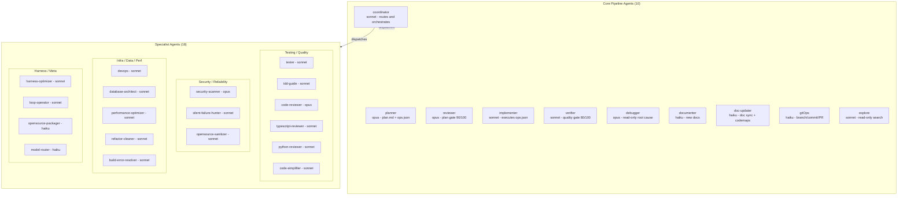
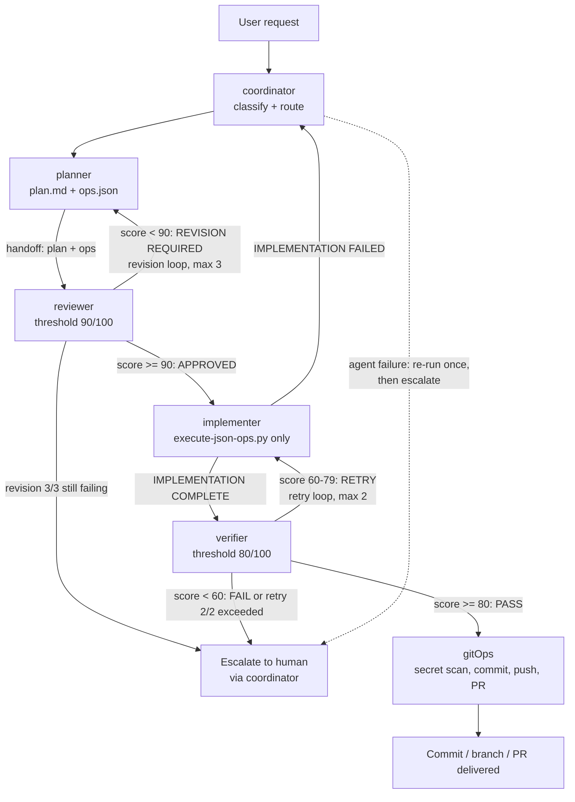

# ClaudeKit Agent System Reference

Split into focused files so no single onboarding read exceeds ~10 KB (plan-remaining-fixes-2026-07-31.md §5a). Start here, follow the links.

## Reference files

- [Agent Interaction Model](AGENTS_INTERACTION_MODEL.md)
- [Core Pipeline Agents: coordinator, planner, reviewer](AGENTS_PIPELINE_1.md)
- [Core Pipeline Agents: implementer, verifier, debugger](AGENTS_PIPELINE_2.md)
- [Core Pipeline Agents: documenter, doc-updater, gitOps](AGENTS_PIPELINE_3.md)
- [Core Pipeline Agents: explore](AGENTS_PIPELINE_4.md)
- [Specialist Agents: tester, security-scanner, devops](AGENTS_SPECIALISTS_1.md)
- [Specialist Agents: database-architect, tdd-guide, refactor-cleaner](AGENTS_SPECIALISTS_2.md)
- [Specialist Agents: silent-failure-hunter, harness-optimizer, performance-optimizer, code-simplifier](AGENTS_SPECIALISTS_3.md)
- [Specialist Agents: typescript-reviewer, python-reviewer, code-reviewer, build-error-resolver](AGENTS_SPECIALISTS_4.md)
- [Specialist Agents: loop-operator, opensource-sanitizer, opensource-packager, model-router](AGENTS_SPECIALISTS_5.md)
- [Meta Docs and Shared Protocols](AGENTS_PROTOCOLS.md)
- [Known Issues](AGENTS_KNOWN_ISSUES.md)

## Architecture Diagrams

### Agent architecture by tier (per QUICK_START.md)

```mermaid
flowchart TB
    subgraph CORE["Core Pipeline Agents (10)"]
        direction TB
        COORD[coordinator<br/>sonnet - routes and orchestrates]
        PLAN[planner<br/>opus - plan.md + ops.json]
        REV[reviewer<br/>opus - plan gate 90/100]
        IMPL[implementer<br/>sonnet - executes ops.json]
        VER[verifier<br/>sonnet - quality gate 80/100]
        DBG[debugger<br/>opus - read-only root cause]
        DOC[documenter<br/>haiku - new docs]
        DOCU[doc-updater<br/>haiku - doc sync + codemaps]
        GIT[gitOps<br/>haiku - branch/commit/PR]
        EXP[explore<br/>sonnet - read-only search]
    end

    subgraph SPEC["Specialist Agents (18)"]
        direction TB
        subgraph TESTQ["Testing / Quality"]
            TEST[tester - sonnet]
            TDD[tdd-guide - sonnet]
            CR[code-reviewer - opus]
            TSR[typescript-reviewer - sonnet]
            PYR[python-reviewer - sonnet]
            SIMP[code-simplifier - sonnet]
        end
        subgraph SEC["Security / Reliability"]
            SS[security-scanner - opus]
            SFH[silent-failure-hunter - sonnet]
            OSS[opensource-sanitizer - sonnet]
        end
        subgraph INFRA["Infra / Data / Perf"]
            DEV[devops - sonnet]
            DBA[database-architect - sonnet]
            PERF[performance-optimizer - sonnet]
            RC[refactor-cleaner - sonnet]
            BER[build-error-resolver - sonnet]
        end
        subgraph METAOPS["Harness / Meta"]
            HO[harness-optimizer - sonnet]
            LO[loop-operator - sonnet]
            OSP[opensource-packager - haiku]
            MR[model-router - haiku]
        end
    end

    COORD -->|dispatches| CORE
    COORD -->|dispatches| SPEC
```

### Feature pipeline with revision and retry loops

```mermaid
flowchart TD
    U[User request] --> C[coordinator<br/>classify + route]
    C --> P[planner<br/>plan.md + ops.json]
    P -->|handoff: plan + ops| R[reviewer<br/>threshold 90/100]
    R -->|score >= 90: APPROVED| I[implementer<br/>execute-json-ops.py only]
    R -->|score < 90: REVISION REQUIRED<br/>revision loop, max 3| P
    R -->|revision 3/3 still failing| ESC[Escalate to human<br/>via coordinator]
    I -->|IMPLEMENTATION COMPLETE| V[verifier<br/>threshold 80/100]
    I -->|IMPLEMENTATION FAILED| C
    V -->|score >= 80: PASS| G[gitOps<br/>secret scan, commit, push, PR]
    V -->|score 60-79: RETRY<br/>retry loop, max 2| I
    V -->|score < 60: FAIL or retry 2/2 exceeded| ESC
    G --> DONE[Commit / branch / PR delivered]
    C -.->|agent failure: re-run once,<br/>then escalate| ESC
```

---

