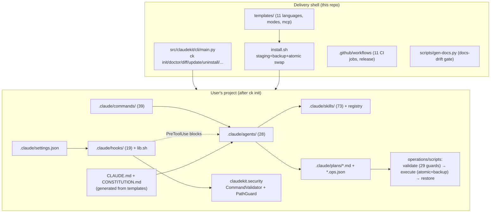
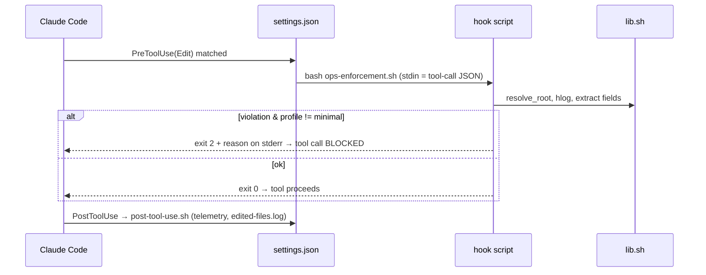

# Architecture

Reverse-engineered from the tree on 2026-07-08 (v2.1.0). Companion user-facing doc: `docs/ARCHITECTURE.md`. This version includes the delivery shell and maintainer concerns.

## 1. Design philosophy

- **Enforcement over exhortation.** Rules live in hooks (exit 2 = block) and validators, not just prompt text.
- **Plan/execute separation.** Agents *propose* changes as data (ops.json); a deterministic Python engine *applies* them. Auditable, reviewable, rollback-capable.
- **File-based handoffs.** Agents communicate through artifacts (`plan.md`, `*.ops.json`, review reports), not shared context. Fresh subagents avoid anchoring and cut tokens (~85% claimed; benchmark pending, task 010).
- **Single responsibility per agent.** Planner plans, Reviewer reviews, Implementer executes. No overlap.
- **Config-driven.** Build/test/lint commands come from `.claude/hooks/config.json` (`project` section); nothing hardcoded per language.
- **Copy, not link.** Installed projects are self-contained; zero runtime dependencies.
- **Honest safety framing.** The security layer is a "denylist speed bump, not a sandbox" (SECURITY.md). Never oversell it.

## 2. Component architecture



## 3. Control flow — the standard pipeline

```mermaid
sequenceDiagram
    participant U as User
    participant C as Coordinator (sonnet)
    participant P as Planner (sonnet)
    participant R as Reviewer (opus)
    participant I as Implementer (sonnet)
    participant V as Verifier (haiku)
    participant G as GitOps (haiku)
    U->>C: /plan Add JWT auth
    C->>P: HANDOFF (task, classification, constraints)
    P->>P: explore codebase; load writing-plans,<br/>generate-operations-config skills
    P-->>C: .claude/plans/plan-X.md + X.ops.json
    C->>R: review plan
    R->>R: score: Plan 40% + Architecture 30% + Security 30%
    alt score < 90
        R-->>P: rejection report → re-plan (or /refine loop)
    else score ≥ 90
        R-->>C: APPROVED
        C->>I: implement
        I->>I: validate-config-json.py (29 guards)<br/>execute-json-ops.py (backup → atomic apply)
        I-->>C: execution report
        C->>V: verify
        V->>V: score: static 30% + tests 40% + coverage 30%
        alt score < 80
            V-->>I: fix or flag
        else score ≥ 80
            C->>G: commit / PR (secret scan, conventional commit)
        end
    end
```

The Implementer's **Iron Law**: no ops.json → STOP and request one; never manual Edit/Write fallback. This is double-enforced by `ops-enforcement.sh` (PreToolUse hook).

Alternative pipelines (see [WORKFLOW.md](WORKFLOW.md)): PRP 4-phase (`/prp-plan → /prp-implement → /prp-commit → /prp-pr`), adversarial review (`/santa` dual Opus+Sonnet, `/gan-build` generator/evaluator loop), autonomous loops (`/loop-start` + loop-operator), open-source pipeline (`/opensource`, hard-gated 3 stages), audit fan-out (`/audit` = explore + silent-failure-hunter + security-scanner in parallel).

## 4. Tool lifecycle — how a hook intercepts a tool call



Event map (full detail in [HOOKS.md](HOOKS.md)): PreToolUse on Edit/Write → ops-enforcement, config-protection, security-reminder, file-guard-gate; PreToolUse on Bash → command-guard, block-no-verify, commit-quality, pre-commit (on `git commit`), pre-push (on `git push`); UserPromptSubmit → injection-scan-gate, pre-plan; SessionStart → session-start; Stop → final checks, cost-tracker, desktop-notify, format-typecheck; plus PostToolUse/PostToolUseFailure/SubagentStop telemetry.

## 5. Prompt lifecycle

1. User types `/plan X` → Claude Code expands `.claude/commands/plan.md`.
2. Command prompt dispatches the target agent per `_shared/INVOCATION.md` (scoped `--allowedTools`, **never** `--dangerously-skip-permissions` — CI-gated).
3. Agent frontmatter sets model + tools; body defines role, workflow, output contract.
4. Agent loads mandatory skills (`using-superpowers`, `golden-rule`) then task skills per `skills-registry.json`.
5. Output is written as artifacts under `.claude/plans/`; handoffs follow `HANDOFF_PROTOCOL.md` block format (`HANDOFF TO:` + task/classification/pipeline position/files/constraints/expected output/return-to).

## 6. Memory & state flow

| State | Location | Written by | Read by |
|-------|----------|-----------|---------|
| Plans + ops configs | `.claude/plans/` | planner | reviewer, implementer, hooks |
| Session context | `.claude/session-context.md` | /save-session, context-keeper | /resume-session, session-start hook |
| Backups | ops engine backup dir | execute-json-ops.py | restore-backup.py, `ck rollback` |
| Install manifest | `.claude/.claudekit-manifest.json` (version + per-file sha256) | install.sh | `ck diff/update/uninstall/doctor` |
| Hook telemetry | `.claude/hooks/{hooks.log,cost-tracker.log,edited-files.log,compact-counter.txt}` | hooks | humans, harness-optimizer, cost-tracker |
| Project commands | `.claude/hooks/config.json` (`project.build_cmd` etc.) | installer/user | all hooks, format-typecheck |

Session-continuity freshness rules (skill): <4h full trust, 4–24h verify, >72h warn stale.

## 7. Security model

Layers (details in [SECURITY_GUIDE.md](SECURITY_GUIDE.md)):
1. Claude Code's own permission prompts (never bypassed — CI `permission-gate`).
2. PreToolUse hooks (fail-closed blocking, `ECC_HOOK_PROFILE`-gated).
3. `CommandValidator` — blocklist + dangerous patterns; splits chained commands (`; && || |`) and inspects `$(...)`/backtick payloads; no bash/sh/env/xargs on the allowlist; detects `find -delete/-exec`, `${IFS}` evasion, Python interpreter smuggling. Exposed as `ck check-command`, `python3 -m claudekit.security`, and `command-guard.sh`.
4. `PathGuard` — protected patterns (`.env`, `.git/config`, …) matched per path component; symlinks resolved against the link's directory; `MAX_DIRECTORY_DEPTH`.
5. Ops engine guards (29) — protected files can't be deleted, MAX_DELETIONS=3/plan, null-byte checks, ambiguous-match rejection, schema validation.
6. Supply chain: SHA-pinned GitHub Actions, Dependabot, secret scans in pre-commit/gitOps.

Threat-model honesty: this is defense-in-depth against *accidents and casual misuse*, not a sandbox against a determined adversary. SECURITY.md discloses this plus the prompt-injection reality.

## 8. Build, packaging, deployment

- `pyproject.toml`: setuptools backend, src-layout, entry points `claudekit`/`ck` → `claudekit.cli.main:main`. Optional extras: `validation` (jsonschema), `dev`.
- `setup.py` bundles the asset tree into the wheel at `<prefix>/share/claudekit` so pure-pip installs are self-contained; `MANIFEST.in` covers the sdist.
- Release: push tag → `release.yml` → build → PyPI **Trusted Publishing** (no token secrets). Not yet exercised.
- CI (`ci.yml`, 11 jobs): test matrix (ubuntu+macos × py3.9/3.10/3.12/3.13), coverage (security module ≥85%), lint (ruff+mypy), docs-drift, dangling-hooks, shellcheck, permission-gate, structure, validate-registry, package-smoke (wheel → clean venv → standalone `ck init`+`doctor`), install-integration (`install.sh` → `doctor`).

## 9. Performance considerations

Hot spots are token- and latency-side, not CPU-side: hook chains cost ~150–300 ms per tool call (consolidation to one dispatcher per event is roadmapped, task 009/roadmap §2.4); the routing surface (coordinator boot + registry + frontmatter) costs ~12–35K tokens (audit ai-review §5). Mandatory skill loads should stay ≤2 per agent. See [PERFORMANCE_GUIDE.md](PERFORMANCE_GUIDE.md).

## 10. MCP integration

`templates/mcp/mcp-settings.json` ships optional configs for Context7, Sequential Thinking, Playwright, Memory, and Filesystem MCP servers; the `mcp-integration` skill guides usage. Roadmap direction: pin server versions (no `npx -y @latest`), and eventually expose the ops engine itself as an MCP server (roadmap §3.3).
