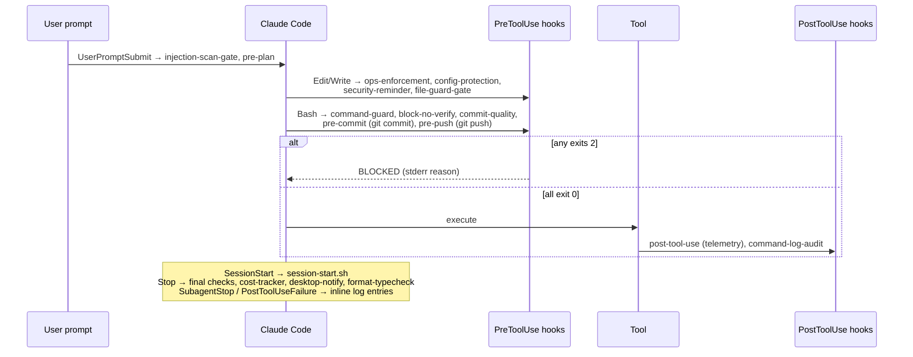

# Hooks Catalog

19 hook scripts in `.claude/hooks/` + `lib.sh`, wired through `.claude/settings.json` (the **only** place hooks are registered — `hooks/config.json` is legacy for hook definitions but remains the live source of `project.*` commands: `build_cmd`, `test_cmd`, `lint_cmd`, `coverage_cmd`). User-facing doc: `docs/HOOKS.md`. Template hooks (installable extras) live in `templates/hooks/`.

## Contract

- Hook receives the tool-call payload as **JSON on stdin** (never env vars — the historic env-var assumption meant telemetry was dead until v2.1).
- Exit codes: `0` allow · `2` **block** (message on **stderr**) · anything else = non-blocking error. Blocking hooks **fail closed**: if they can't parse the payload they block rather than allow.
- Enforcement gated by `ECC_HOOK_PROFILE`: `minimal` (enforcement off — kit development), `standard` (default; command-guard warns instead of blocking), `strict` (everything blocks).
- Shared helpers in `lib.sh`: `resolve_root` (git toplevel with fallback), `hlog` (append to hooks.log, logs parse failures), `deny` (stderr + exit 2), `OPS_FIND_EXPR`/`OPS_REGEX` (matches **both** `*.ops.json` and `ops-*.json` — never reintroduce the split-brain).

## Lifecycle

## PreToolUse — blocking enforcement

| Hook | Matcher | Blocks when |
|------|---------|-------------|
| `ops-enforcement.sh` | Edit/Write | Editing source files outside `.claude/`+docs without an approved ops.json (the Iron Law's mechanical teeth). Bypass hints were removed in v2.1. |
| `config-protection.sh` | Edit/Write | Modifying protected configs (package.json, pyproject.toml, tsconfig…). Anchored patterns; creating a **new** pyproject.toml is allowed (was a false-positive bug). |
| `file-guard-gate.sh` | Edit/Write | Touching sensitive paths (`.env`, keys, `.git/config`) — delegates to PathGuard semantics. |
| `command-guard.sh` | Bash | Command fails `claudekit.security` validation. `strict`=block, `standard`=warn, `minimal`=off. |
| `block-no-verify.sh` | Bash | `git commit/push --no-verify` (git-scoped, quote-stripped matching — not a naive substring). |
| `commit-quality.sh` | Bash | Non-conventional commit message; also blocks staged secrets (proven by test `4ef8d38`). bash-3.2 safe (`tr`, not `${VAR,,}`). |
| `pre-commit.sh` | Bash (`git commit`) | Invalid ops.json in `.claude/plans/`, staged secret patterns (incl. single-quoted — `\x27` fix), build failure on source changes. |
| `pre-push.sh` | Bash (`git push`) | Test/lint/build failures (commands from config.json `project.*`). |
| `security-reminder.sh` | Edit/Write | Non-blocking advisory: prints security notes for sensitive-looking edits. |
| `suggest-compact.sh` | (all PreToolUse, async) | Never blocks; suggests `/compact` based on `compact-counter.txt`. Stale-lock and macOS `date` bugs fixed. |

## UserPromptSubmit

| Hook | Purpose |
|------|---------|
| `injection-scan-gate.sh` | Scans prompt content for injection patterns (pairs with the `prompt-injection-defense` skill patterns). |
| `pre-plan.sh` | On "plan X" phrasing: warns about duplicate/existing plans in `.claude/plans/`. |

## PostToolUse / telemetry (never block)

| Hook | Purpose |
|------|---------|
| `post-tool-use.sh` | Reads stdin JSON; records modifications to `edited-files.log`, revalidates touched ops files, feeds cost tracking. |
| `command-log-audit.sh` | Appends executed Bash commands to the audit log (async). |

## SessionStart / Stop

| Hook | Purpose |
|------|---------|
| `session-start.sh` | Detects language, loads config, prints startup summary, auto-loads recent `.claude/session-context.md`. |
| Stop inline script (settings.json) | Warns on uncommitted changes; validates all ops.json files in `.claude/plans/`; logs session end. |
| `cost-tracker.sh` | Aggregates usage into `cost-tracker.log` (async). |
| `desktop-notify.sh` | OS notification that the session ended (async). |
| `format-typecheck.sh` | Runs formatter/typechecker from config.json commands (async). |
| `post-implement.sh` | After implementation flows: runs tests/coverage (invoked by workflow, not settings.json event). |

Inline settings.json snippets also log SubagentStop and PostToolUseFailure events to `hooks.log`.

## State & log files (gitignored where appropriate)

`hooks.log` (all hook activity — first stop when debugging), `cost-tracker.log`, `edited-files.log`, `compact-counter.txt`. Historic leak: a 159 KB hooks.log was once committed (audit item 24); keep logs out of git.

## Template hooks (`templates/hooks/`, opt-in installs)

`auto-checkpoint.sh` (periodic stash checkpoints — records stash SHAs, not `stash@{0}`), `file-guard.sh`, `prompt-injection-scanner.sh` (standalone ancestors of the wired gate hooks), `check-comment-replacement.sh` (blocks the "replaced code with a comment" anti-pattern).

## Known issues

- 9–15 process spawns per tool call; roadmap §2.4 wants one dispatcher per event (~100 ms/call saving). Do not "fix" this by silently dropping hooks.
- `hooks/config.json` header says deprecated (for hook *definitions*) yet its `project.*` section is load-bearing for 6+ hooks — confusing but intentional; docs/HOOKS.md explains.
- loop-operator's autonomous-loop block-list is still narration-enforced, not hook-enforced (roadmap item 19).
