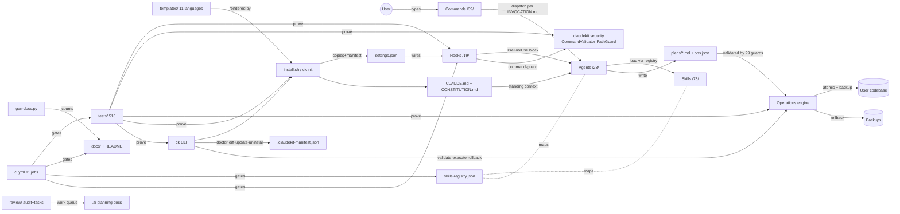
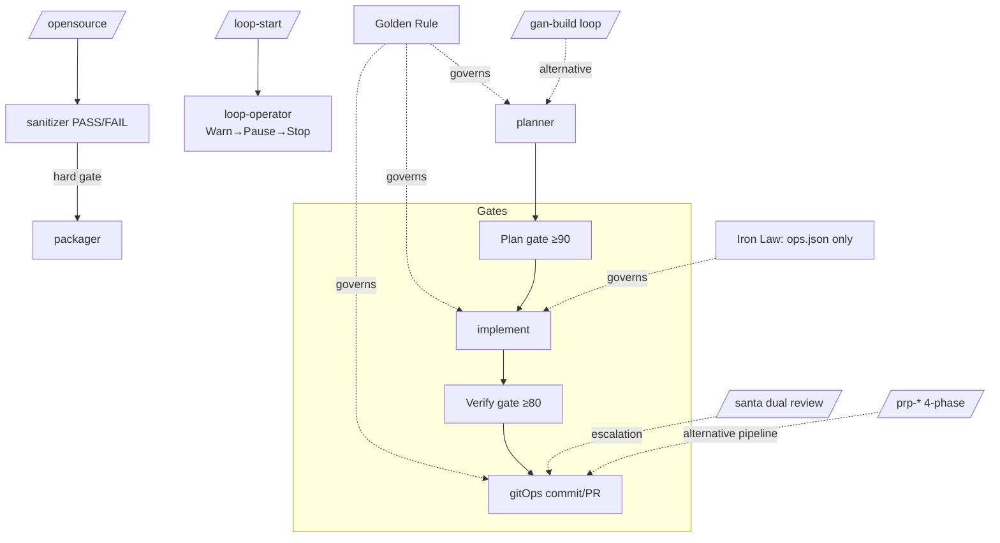

# Knowledge Graph

How everything relates. Node detail lives in the catalogs: [AGENTS.md](AGENTS.md), [COMMANDS.md](COMMANDS.md), [SKILLS.md](SKILLS.md), [HOOKS.md](HOOKS.md).

## Core relationships

## Pipeline / concept relationships

## Traceability spine

Feature promise (README) → enforcing mechanism (hook/guard/CI job) → proving test (tests/) → documenting page (docs/ + .ai/). When adding anything, complete all four links — the audit's core finding was promises with missing mechanism/test links.

| Promise | Mechanism | Test | Doc |
|---------|-----------|------|-----|
| "Plans before code" | ops-enforcement.sh + Iron Law | test_hooks_behavioral | HOOKS/DOMAIN |
| "29 safety guards" | validate-config-json.py | test_validator | SKILLS §ops |
| "Safe execution, rollback" | execute-json-ops / restore-backup | test_validator, behavioral | SKILLS §ops |
| "Hooks block" | exit-2 contract + settings.json | test_hooks_behavioral | HOOKS |
| "Command safety" | CommandValidator + command-guard | test_security(+hooks) | SECURITY_GUIDE |
| "Self-contained install" | wheel share/claudekit + manifest | test_packaging, test_install | ARCHITECTURE §8 |
| "Counts are true" | gen-docs.py + docs-drift CI | (CI job) | everywhere |
| "No permission bypass" | INVOCATION.md + permission-gate CI | (CI job) | AGENTS/SECURITY |
